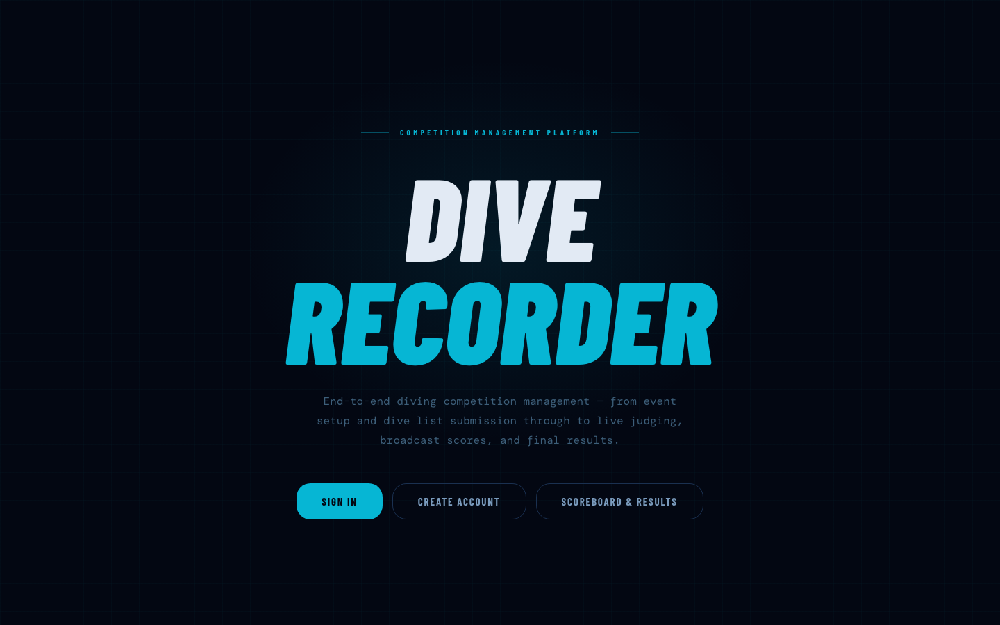
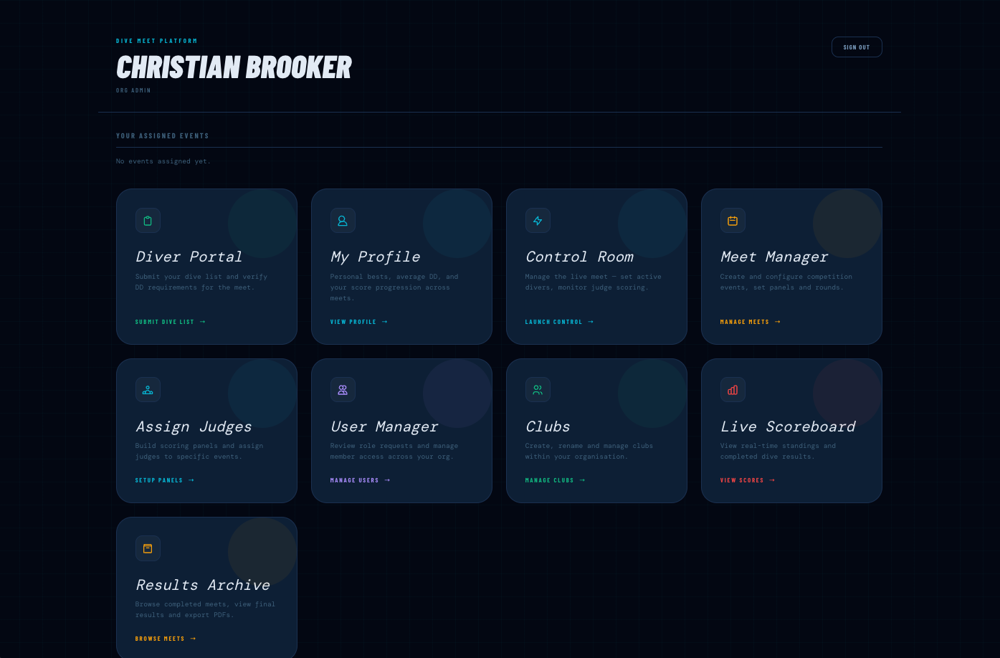
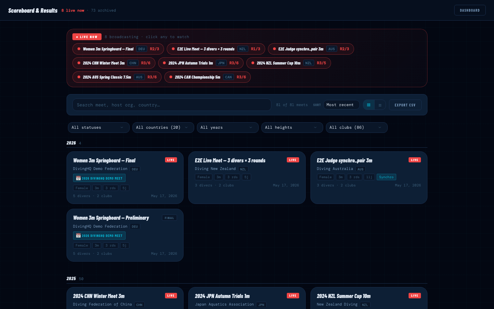
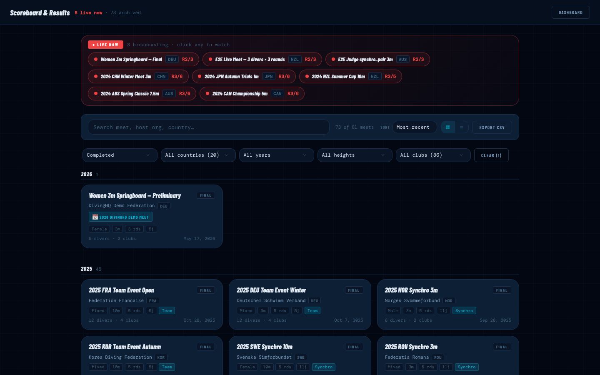
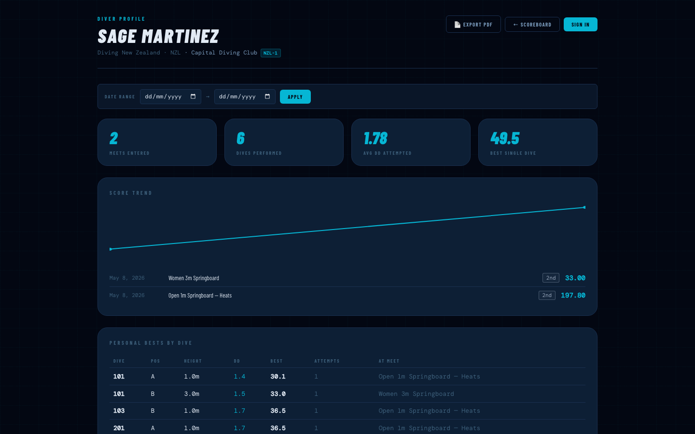

# DiveRecorder

A multi-tenant diving competition scoring app. Real-time judge scoring over WebSockets, World Aquatics-compliant point calculations, prelim → semi → final progression, role-based dashboards (diver / coach / referee / meet manager), self-serve analytics, and a printable program / results pipeline that goes from "live broadcast" to "PDF export" without leaving the app.

Built around five audiences:

- **Divers** — Diver Portal for building and submitting dive lists per event (with World Aquatics DD lookup, height filter, synchro partner autocomplete), plus a personal profile with PBs, score-trend sparkline, average DD, best single dive, and a customisable analytics dashboard with 10+ widgets.
- **Coaches** — A `coach` role with a per-coach roster of linked divers and one-click access to each diver's profile.
- **Meet operators** — Control room view advances divers, broadcasts state to judges and the public scoreboard, finalises events. 30-second shot clock, hold/resume, score correction, queue reorder, late entry, audit-logged referee actions.
- **Judges** — Single-purpose phone-friendly view that submits scores back to the server in real time. Synchro panels see role hints (Exec A / Exec B / Sync) so they know which judging slot they're filling.
- **Spectators** — Public scoreboard with current performer, live standings, per-round leaderboard with movement arrows, public meet landing pages, and an archive of completed meets.

---

## Table of contents

- [Screenshots](#screenshots)
- [Tech stack](#tech-stack)
- [Features](#features)
- [Local setup](#local-setup)
- [Production deploy](#production-deploy)
- [Project structure](#project-structure)
- [Roles](#roles)
- [Reporting a bug](#reporting-a-bug)
- [Scripts](#scripts)
- [End-to-end tests](#end-to-end-tests)
- [Contributing](#contributing)
- [License](#license)

> Each section below is collapsible — click the heading to expand or collapse.

---

<details open>
<summary><h2 id="screenshots">Screenshots</h2></summary>

### Home

The public landing page. Anyone can sign in, create an account, watch a live meet, or browse the archive without logging in.



### Dashboard

Each user's role-based hub. Tiles surface only the areas the user has access to — divers see "My Profile" and "Diver Portal", admins additionally see User Manager, Clubs, Teams, etc.



### Live Scoreboard (completed meet recap)

When a meet is over, the Scoreboard switches to a recap layout: podium spotlight, full standings with club lines, and a per-diver dive-by-dive breakdown. Per-judge scores are colour-coded by FINA category (excellent → failed) with the trim rule visualised by struck-through dimmed scores.



### Results Archive (now part of the unified Scoreboard)

Browse every completed meet. Filter by country, year, height, club, or just search across event/org/country. Each event card shows competitor and club counts so you can see meet size at a glance, and PDFs are one click away.



### Diver Profile

Per-diver stats: meets entered, dives performed, average DD attempted, best single dive, an SVG sparkline of total scores across meets, and a personal-bests table keyed by dive code + position + height. Each diver picks which of 10+ analytics widgets to show via a "Customize" modal — the choices persist per-user.



---

</details>

<details>
<summary><h2 id="tech-stack">Tech stack</h2></summary>

- **Frontend**: Vue 3 (Composition API, `<script setup>`), Vite 6, Vue Router, Pinia
- **Backend**: Node 18+, Express 5, Socket.IO 4, [`pg`](https://node-postgres.com/), `pdfkit`, `nodemailer`
- **Auth**: JSON Web Tokens, bcrypt password hashing, password-reset email flow with single-use tokens
- **Database**: PostgreSQL 14+ with `uuid-ossp` and `pgcrypto`
- **PWA**: service worker (network-first navigation + cache-first assets), web app manifest, IndexedDB-backed offline caching

The project intentionally avoids a build-time framework like Nuxt or Next — the SPA is plain Vite, the server is a single Express app split into thin route modules. Easier to read end-to-end.

---

</details>

<details>
<summary><h2 id="features">Features</h2></summary>

### Live scoring & operations

- Operator picks the active diver in the Control Room → judges' phones receive a `state_update` socket event → judges submit scores → control room advances to the next diver.
- **30-second shot clock** auto-starts when a diver is set; pause/reset; visual amber/red countdown; audible alert at 0.
- **Hold / resume** the meet (video review, judge consultation) — broadcasts an amber banner to the spectator scoreboard and disables the judge submit button. Reason text shown publicly.
- **Score correction** — click any completed dive in the Control Room history; modal lets the manager pick a judge, edit the value, and provide a reason. Audit-logged with old/new values, actor, IP, user agent.
- **Round-end transition** — when the last diver of a round scores their last judge, the operator gets a prompt to announce standings to the audience.
- **Referee actions** — failed dive, cap score, redive — broadcast and persisted in the score audit log.
- **Score persistence + audit logging** on every submission (judge id, IP, user agent). Per-judge socket rate limit (60 submissions/min) blocks abuse.
- **Connection-lost banners** on Judge + Scoreboard views so a flaky pool-deck wifi is visible immediately.

### World Aquatics scoring

A small set of PostgreSQL functions does all the scoring so totals are consistent across every standings, leaderboard, archive, and PDF query:

- `calc_dive_points(scores, num_judges, dd)` — official trim-and-multiply rules across panel sizes (3 / 5 / 7 / 9 / 11 judges); 9- and 11-judge totals are normalised so dive points stay comparable.
- `calc_synchro_dive_points(judge_numbers, scores, num_judges, dd)` — World Aquatics synchronised rule: judges 1–2 (or 1–3 on an 11-panel) score Diver A execution, the next group score Diver B execution, the rest score sync. Trimmed and multiplied by `× DD × 0.6` to keep magnitude comparable to individual dives.
- `calc_event_dive_points(...)` — dispatches to the right rule per dive, including the FINA Team Event case where a single event mixes individual and synchro dives.

### Event configuration

Events flex for almost any meet format:

- **Three-stage progression** — Preliminary (all entrants) → Semi-Final (top 18) → Final (top 12). The chain length is operator-defined per event (synchro and team meets typically skip the semi). One-click "Advance Top N →" pulls top-rank divers and seeds the next stage with their dive lists. Idempotent — safe to re-run after a score correction.
- **Age groups / divisions** — free text so any federation's naming works (`U14`, `Open`, `Masters 30-34`, `Para`).
- **Scheduled start time** — feeds the meet schedule view and notifications.
- **Per-round DD limits** — common in junior events (rounds 1–N capped to a max DD).
- **Event templates** — save a fully-built event configuration once, apply to a new event with one click. Per-org, name-keyed.
- **CSV roster import** — paste a roster, server creates all the dive list rows in one transaction; per-row errors reported without failing the whole import.

### Multi-event meets

A meet bundles multiple events ("2026 National Open" → 1m M/F, 3m M/F, 10m M/F, synchro, team).

- Public meet landing page at `/meet/:id` with hero (org, dates, venue, sponsor), live/upcoming/completed status counts, and event grid.
- One-click **printable program PDF** with the full schedule, format, judges, age group, competitor counts.
- Optional sponsor branding on the meet record (logo URL + link).

### Results archive

- Browse completed meets with filters: search, country, year, height, club, status.
- Each event card shows competitor and club counts derived from a `LATERAL` aggregate.
- Per-event detail view with podium spotlight, full standings, dive-by-dive breakdown grouped by diver. Synchro events show role-grouped panels.
- One-click PDF export with the same standings + dive breakdown.
- CSV export of the filtered meets list for federation reporting.

### Diver profile + analytics

- Headline stats: meets entered, dives performed, average DD attempted, best single dive.
- SVG sparkline of score progression across meets.
- Personal best per (dive code + position + height) with attempts and "first set at" meet.
- **Self-serve analytics dashboard** — each diver picks which widgets to show via a "Customize" modal. Catalog includes:
  - Score Trend, Personal Bests
  - Recent Form (last 5 meets with rank "/of N")
  - Medal Counts (gold / silver / bronze / finalist / 9th+)
  - Height Breakdown (avg + best per board height, with bars)
  - Round-by-Round Form (with stamina insight: "you finish strong" / "you fade" / "even pacing")
  - Score Quality Mix (FINA category distribution)
  - DD Risk Profile (avg / max DD + scoring at top DDs)
  - Go-To Dives (most-attempted with avg / best)
  - Current Streak (consecutive podiums / wins, self-hides when none)
  - Compare-to-Peers (your stats vs the org average)
  - Event-Type Splits (individual vs synchro vs team performance)
  - Year-over-Year (this season vs last)
- **Date range filter** at the top of the dashboard — every widget respects it.
- **Export Dashboard PDF** — Cmd-P / Ctrl-P opens a print-friendly view that saves to PDF in one step.
- **Drag-to-reorder** widgets in the Customize modal.
- **Compare two divers** head-to-head at `/compare?a=&b=` — side-by-side stats and per-dive PB diff.

### Multi-tenant model

- Two levels of organisational nesting: **organisations** (country federations) → **clubs** (within an org).
- **Teams** sit alongside clubs as a separate grouping for FINA Team Event entries (a diver can belong to multiple teams over time).
- **Coach ↔ Diver links** — a coach can mentor multiple divers; a diver may have multiple coaches over time. Org admins manage the links from the User Manager drawer.
- Users belong to one org and optionally one club within it.
- System admins see across all orgs; org admins / meet managers manage their own.

### Auth & accounts

- JWT auth with bcrypt password hashing.
- **Self-service password change** with current-password verification.
- **Forgot-password flow** — email link with 30-min single-use JWT (single-use enforced via a password-hash fingerprint, no nonce table).
- Hygiene email on every successful password change.
- Welcome email on registration.
- Org admin notified by email when a new role request lands.

### Notifications

Email triggers (best-effort, never block the response):

- Welcome on registration
- Role-request landing → org admins
- Role-decision (approved / rejected) → applicant
- Password changed → user
- Password reset link → user
- Meet went Live → every competitor
- Results posted → every competitor

### Admin tooling

- **User Manager** (`/users`): search, role filter chips, org filter, group-by-org, bulk role apply, paginated table, click-row-to-edit drawer with role audit history, club editor, **coach link manager**.
- **Clubs** (`/clubs`): list, create, rename, delete with member counts.
- **Teams** (`/teams`): list, create, rename, delete (non-destructive), inline member drawer, see which events each team is enrolled in.
- **Score Audit Log** (`/events/:id/audit`): per-event timeline of every score insert/update/delete with actor, IP, user agent.
- Role grants/revokes write to a `role_audit_log` table; the User Manager drawer surfaces the per-user history.
- 30-day audit log retention via `purge_audit_logs(retention_days)` — runs on server boot, configurable.
- Schema version stamp logged on boot so an operator can confirm at-a-glance which version is deployed.

### Operator surfaces

- **Broadcast / kiosk mode** — `/scoreboard/:eventId/broadcast` (spectator) and `/control?broadcast=1` (operator) hide page chrome for venue projectors; fonts and tile sizes scale up to read from the back of a pool deck.
- **Operator keyboard shortcuts** in Control Room — ←/→/Space to advance, 1–9 to jump to roster position, S to cycle status (READY → DIVING → JUDGING), T to reset shot clock, F failed, R redive, H hold, L leaderboard.
- **Up Next preview** in the live scoreboard centre column.

### PWA / offline

- Web app manifest + 192/512 PNG icons + SVG icon — installs to home screen on iOS / Android / desktop.
- Service worker: network-first for navigation (deploys reach users immediately), cache-first for hashed assets.
- IndexedDB-backed stale-while-revalidate caching on the diver profile and meets list — return visits feel instant, the diver profile keeps working when wifi is gone.

---

</details>

<details>
<summary><h2 id="local-setup">Local setup</h2></summary>

### 1. Prerequisites

- **Node 18 or newer** (Vite 6 requires it)
- **PostgreSQL 14+** running locally
- The `uuid-ossp` and `pgcrypto` extensions (PostgreSQL ships with them; `init.sql` enables both)

### 2. Clone and install

```bash
git clone https://github.com/JediBrooker/DiveRecorder.git
cd DiveRecorder
npm install
```

### 3. Create and initialise the database

```bash
createdb diverecorder
psql -d diverecorder -f init.sql
```

`init.sql` is the single bootstrap script — it creates every table, enum, function and index, loads the full World Aquatics dive directory (~830 dives), and creates a system-admin account so you can sign in immediately. Schema version is logged on server boot.

### 4. (Optional) Seed test data

```bash
psql -d diverecorder -f seed_test_data.sql
```

Adds 20 country federations, 80 clubs, 1000 users, 50 individual events, 20 synchronised pair events (11-judge panels with proper World Aquatics scoring) and 10 team events (3 teams of 4 members each), all with dive lists, judge scores, and matching audit history. Useful for stress-testing the archive, scoreboard, and admin views. Idempotent — safe to re-run; deletes the prior seed before re-inserting.

### 5. Configure environment

```bash
cp .env.example .env
# edit .env with your local DB credentials and a JWT secret
```

For password-reset and notification emails to actually send, also configure SMTP:

```
APP_BASE_URL=https://your-domain.example.com
SMTP_HOST=smtp.your-provider.com
SMTP_PORT=587
SMTP_USER=...
SMTP_PASS=...
SMTP_FROM="Dive Recorder <noreply@your-domain.example.com>"
```

Without `SMTP_HOST` set, every email helper silently no-ops — registrations and password changes work, just no email is dispatched. `APP_BASE_URL` is used to build the reset-password link.

### 6. Sign in

| Account | Username | Password |
|---|---|---|
| System administrator (created by `init.sql`) | `admin` | `admin` |
| Any seeded test user (created by `seed_test_data.sql`) | `bulk_user_0001` … `bulk_user_1000` | `password123` |

Change the `admin` password from the User Manager once you're in.

### 7. Run

In two terminals:

```bash
# Terminal 1 — backend on :3000
npm start

# Terminal 2 — Vite dev server on :5173 (proxies /api and /socket.io to :3000)
npm run dev
```

For a production-ish single-process build:

```bash
npm run build      # builds the SPA into dist/
npm start          # Express serves the API and the dist/ SPA together
```

Open `http://localhost:5173` (dev) or `http://localhost:3000` (built).

---

</details>

<details>
<summary><h2 id="production-deploy">Production deploy</h2></summary>

The repo ships everything you need to run on a real server: a checked-in PM2 ecosystem file, a deploy script that fails closed at every step, and a `/api/health` endpoint for monitors.

### First-time setup on a fresh box

After cloning, installing deps and getting `init.sql` loaded (steps 1–6 above), bring the service up under PM2:

```bash
pm2 start ecosystem.config.js
pm2 save                                  # persist the process list
pm2 startup                               # prints a sudo command — run it
                                          # to register PM2 with systemd

# Log rotation — PM2 appends to logs/pm2-out.log forever by default.
pm2 install pm2-logrotate
pm2 set pm2-logrotate:max_size 10M
pm2 set pm2-logrotate:retain 7
```

`ecosystem.config.js` runs the app as a single fork process named `dive-recorder` with a 512MB memory ceiling, restart-on-crash, and combined stdout/stderr logs in `./logs/`. **Don't enable PM2 clustering** without first wiring up a Socket.IO adapter (Redis or `@socket.io/cluster-adapter`) and moving the in-memory `activeDivers` / `meetHolds` maps out of the node process — clustering without those would split-brain the live-scoring state across workers.

### Subsequent deploys

```bash
./deploy.sh
```

The script:

1. `git pull --ff-only` (refuses non-fast-forward merges)
2. `npm ci` (deterministic install from the lockfile)
3. `npm test` (catches TDZ / boot regressions via the boot test)
4. `npm run build` (builds before migrate so a broken build doesn't leave the DB advanced past code we can't ship)
5. `npm run migrate -- --dry`, then real migrate
6. `pm2 restart dive-recorder`
7. Polls `/api/health` for up to 10s; fails the script if the service didn't come back up, and prints the rollback command (`git reset --hard <prev-sha> && pm2 restart dive-recorder`)

Flags:

| Flag | When |
|---|---|
| (none) | normal deploy |
| `--dry` | preview every step without writing |
| `--skip-tests` | emergency hotfix path; tests skipped but build + health check still gate |

### Health checks + monitoring

`GET /api/health` returns `{ ok: true, schema_version }` on success or `503 { ok: false }` if the DB pool can't issue a trivial query. No auth — point any uptime monitor (UptimeRobot, BetterStack, etc.) at `https://your-domain/api/health` on a 60s interval.

### Rolling back a bad deploy

If `deploy.sh` fails the health check it prints the exact rollback command:

```bash
git reset --hard <previous-sha>
pm2 restart dive-recorder
```

Migrations in this repo are **additive only** (`ADD COLUMN`, `CREATE INDEX`, `ADD CONSTRAINT IF NOT EXISTS`) so leaving them applied during a code rollback is safe — the old code keeps working against the new schema. If a future PR ever needs a destructive change (drop column, rename), do it as a two-deploy dance: ship the code that works against both shapes first, then the migration in a follow-up release.

---

</details>

<details>
<summary><h2 id="project-structure">Project structure</h2></summary>

```
.
├── server.js                       # 650-line bootstrap shell — pool, middleware,
│                                   # factory mounts for 19 route modules,
│                                   # /api/health, SPA fallback, listener
│
├── routes/                         # Every API surface, one module per concern.
│   │                               # Each file exports a factory that takes the
│   │                               # deps it needs and returns an Express router.
│   ├── auth.js                     # /api/auth/* (login, register, verify-email,
│   │                               # forgot/reset password)
│   ├── orgs.js                     # /api/orgs/*, /api/clubs/*, per-org divers
│   ├── teams.js                    # team CRUD + members + dive-lists + event_teams
│   ├── coach.js                    # /api/coach/dashboard, /divers, link admin
│   ├── meets.js                    # meet CRUD + event-to-meet assignment
│   ├── users.js                    # user listing + role grants + role requests
│   ├── events.js                   # event CRUD + status flips
│   ├── event-staff.js              # event managers + judge panel + per-judge views
│   ├── control-room.js             # roster + reorder + randomise + check-in + CSV
│   ├── scoreboard.js               # /api/scoreboard/:eventId + /leaderboard
│   ├── score-correction.js         # PUT /api/scores/:id + /api/events/:id/score-audit
│   ├── archive.js                  # public results archive
│   ├── pdf.js                      # 4 PDFs (program, start-list, score-sheet,
│   │                               # results) + 1 CSV export
│   ├── diver-profile.js            # /api/divers/:id/profile + /analytics + dashboard
│   ├── diver-search.js             # cross-org diver autocomplete + browse
│   ├── competitor.js               # POST /api/competitor/submit-list
│   ├── templates.js                # per-diver dive-list templates
│   ├── dive-directory.js           # GET /api/dive-directory
│   └── socket.js                   # every io.use / socket.on handler
│
├── lib/                            # Shared backend modules consumed by routes/*.
│   ├── middleware.js               # verifyToken, requireOrgRole, event gates,
│   │                               # token-version cache, score validation
│   ├── email.js                    # send-* helpers + bcrypt-hash fingerprint
│   ├── records.js                  # checkAndApplyRecords + GET /api/records
│   ├── live-state.js               # activeDivers + meetHolds maps (single-process)
│   ├── scoreboard-cache.js         # 5s TTL with explicit invalidation on commits
│   └── public-id.js                # opaque id hashing for spectator UI
│
├── db/queries.js                   # Reusable SQL CTE strings (PER_DIVE,
│                                   # FULL_FIELD_RANKING) shared by analytics +
│                                   # archive queries
│
├── init.sql                        # One-shot bootstrap: every table + enum +
│                                   # function + index + the dive directory
│                                   # (~830 rows) + the system-admin account.
│                                   # Stamps schema_meta to the current version.
├── seed_test_data.sql              # Optional: 20 federations, 80 clubs,
│                                   # 1000 users, 80 events, 18k scores. Idempotent.
├── migrations/                     # Append-only schema changes (008 onwards).
│                                   # Each is idempotent (CREATE … IF NOT EXISTS,
│                                   # backfills gated on DO blocks).
│
├── scripts/migrate.js              # Migration runner — reads schema_meta.version,
│                                   # applies pending files in order. Wraps each
│                                   # file in its own txn. --dry / --to N flags.
│
├── deploy.sh                       # Production deploy script: pull → npm ci →
│                                   # npm test → npm run build → npm run migrate →
│                                   # pm2 restart → /api/health probe. Fails the
│                                   # script (with rollback hint) on any step.
├── ecosystem.config.js             # PM2 config — single fork process, 512MB
│                                   # memory ceiling, restart-on-crash. Notes
│                                   # why we don't cluster (Socket.IO + in-memory
│                                   # state would split-brain).
│
├── src/                            # Vue 3 SPA (Vite, Composition API)
│   ├── views/                      # One Vue component per route
│   ├── components/                 # Shared building blocks
│   ├── composables/                # useSocket, useOfflineApi, useScoreCategories,
│   │                               # useScoreTrim
│   ├── stores/auth.js              # Pinia auth store (apiFetch helper, 401 →
│   │                               # /login redirect, JWT in sessionStorage)
│   ├── lib/idbCache.js             # IndexedDB stale-while-revalidate helper
│   ├── router/index.js             # vue-router config
│   └── main.js, App.vue
│
├── public/
│   ├── css/app.css                 # Shared design tokens (one stylesheet)
│   ├── icon.svg / icon-*.png       # PWA icons
│   ├── manifest.webmanifest        # Web app manifest
│   └── sw.js                       # Service worker (network-first navigation,
│                                   # cache-first hashed assets)
│
├── test/                           # Node test runner — `npm test` runs all four.
│   ├── syntax.test.js              # Parser + boot test (catches TDZ /
│   │                               # missing-binding regressions) + schema
│   │                               # version pin + scoreCategory boundaries
│   ├── calc.test.js                # World Aquatics scoring tests vs Postgres
│   ├── score-trim.test.js          # Trim algorithm parity (matches the
│   │                               # SQL function across 3/5/7/9/11 panels)
│   └── integration.test.js         # End-to-end: register-org → login →
│                                   # event create → analytics → recent_form
│                                   # ranking regression (#67a5708)
│
├── logs/                           # PM2 log target (gitignored content;
│                                   # directory committed for first-boot)
│
└── .github/
    ├── workflows/ci.yml            # Lint + build + Postgres test matrix
    └── ISSUE_TEMPLATE/bug_report.md
```

The split is the result of an incremental refactor from a single 6,400-line `server.js` to the current 650-line shell + 19 route modules + 6 lib modules. Every module is independently mountable; the `Phase N of server.js split` commits in the git history walk through each extraction with tests passing between every step.

---

</details>

<details>
<summary><h2 id="roles">Roles</h2></summary>

DiveRecorder has eight role personas — seven values in the `org_role` enum plus the `is_system_admin` boolean flag. Each persona below describes the role's context and the things that role can actually do in the app.

### `is_system_admin` — Platform operator

The platform operator runs DiveRecorder as a multi-tenant SaaS — the only person who sees across every federation on the system. They're the last line of defence when something goes wrong, whether that's a stuck migration, a suspicious score change, or an org admin who's locked themselves out the morning of a national championship. Their authority is orthogonal to `org_role`: not "in" any single org, but above all of them.

**What they can do:**
- Approve or reject new federation sign-ups (`/api/orgs/pending`)
- Run database migrations and inspect `schema_meta` to confirm the deployed version
- Read `score_audit_log` and `role_audit_log` across every org
- See every event in every org via `/api/events` (no org filter)
- Override the org filter on read endpoints (e.g. edit any event regardless of `org_id`)
- Reset passwords and unlock accounts for any user

### `org_admin` — Federation administrator

Top of the food chain inside one federation — the person whose name is on the records book. They don't typically run meets themselves, but they decide who does: promoting meet managers, certifying judges, approving coach-diver links. They care about the integrity of the records and the credibility of the scoreboard when sponsors look at it.

**What they can do:**
- Create events and meets (`POST /api/events`, `POST /api/meets`)
- Promote, demote, and remove org roles within their federation
- Approve or reject coach⇄diver linking requests
- Edit or delete any event in their org
- Set `entries_close_at` on events to enforce registration deadlines
- Sign off federation records (`records_federation`)
- Manage clubs and teams within the federation

### `meet_manager` — Meet organiser

The person actually running the meet on the day. They live in ControlView for those eight hours: starting every event on time, keeping the queue clean, and surviving the inevitable late-arriving diver without the controller crashing.

**What they can do:**
- Schedule events (`scheduled_at`) and set the registration deadline (`entries_close_at`)
- Import the roster from CSV (`POST /api/events/:id/roster/import`)
- Lock the dive order, drag-reorder before the event starts, randomise starts
- Drive ControlView during the meet — advance divers round-by-round
- Flip event status: `Upcoming → Live → Completed`
- Add a late-arriving diver via the late-entry override (works after entries close)
- Edit a team's bulk dive list (`POST /api/teams/:teamId/dive-lists`)
- Withdraw or scratch divers mid-event

### `referee` — Meet official

The licensed official on deck. They don't score dives themselves — they supervise the panel that does. They confirm the right number of judges are seated, watch the scoreboard for anomalies during the meet (a judge drifting two points low across the panel, a missed drop), and adjudicate when a coach challenges a score.

**What they can do:**
- View the live ScoreboardView for any event they're assigned to
- Read the per-event `score_audit_log` to see who entered or changed each score
- Authorise a score correction (the audit row records them as the actor)
- Confirm synchro panels have valid exec/sync subgroups (9 or 11 judges)
- See the full panel composition in `event_judges` before the event starts

### `judge` — Scoring panel member

Part-time scoring staff who work meet by meet. Usually on a phone in landscape — watching the diver, tapping a score, moving on. The app's single job for them is to make scoring frictionless.

**What they can do:**
- Log into JudgeView on phone for any event they're assigned to (`event_judges`)
- See the current diver, their dive code, position, and DD as it changes round by round
- Tap a half-point score (0.0 → 10.0) on the dial
- Submit the score over the socket (rate-limited per-judge to prevent double-taps)
- See their own submitted score reflected immediately

### `coach` — Diver mentor

Works most closely with individual diver data. Spotting trends — a 5132D drifting two judges down over three meets — comparing two divers head-to-head before nationals, and saving dive-list templates so a 3m optionals list isn't retyped every weekend.

**What they can do:**
- Request to be linked to a diver via `coach_diver_links` (subject to org admin approval)
- View each linked diver's full profile: recent form, judges' individual scores, PB by board height
- Compare two divers head-to-head in CompareView
- Save and re-use dive-list templates, scoped per board height
- See historical scores at the dive-code-and-position level (e.g. their last ten 105Bs)

### `diver` — Athlete

Phone-native and impatient — the app needs to get out of their way. The night before each meet they submit their list; during the meet they watch their own scoreboard between rounds and review judges' scores after each round to calibrate against the panel.

**What they can do:**
- Submit a dive list for an event (`POST /api/competitor/submit-list`) — only while the event is `Upcoming` *and* `entries_close_at` hasn't passed
- Save the current list as a named template, scoped to the event's board height
- Load a saved template and tweak before submitting
- Pick a synchro partner via the autocomplete (filters fellow divers in the org)
- Watch the live ScoreboardView for any event they're in
- Review own profile: recent form, individual judges' scores, PBs by board height

### `spectator` — Public viewer

Friends, family, sponsors. Often anonymous — no account, no token. Frequently watching from a phone on patchy 4G. The app's job for them is zero-friction live spectating.

**What they can do:**
- Open the public scoreboard URL with no login required
- Watch scores update live over the socket as judges submit
- See only events in `Live` or `Completed` status (anonymous filter on `/api/events`)
- See published records (`records_personal`, `records_club`, `records_federation`)
- *Cannot* see anyone's dive list before the event goes Live — that's locked to authenticated users

### Summary

| Role enum | Tenancy | Primary surface | Headline capability |
|---|---|---|---|
| `is_system_admin` | Cross-org | Admin console + audit logs | Operate the platform across every federation |
| `org_admin` | One org, full control | ManagerView | Run the federation: events, roles, records, deadlines |
| `meet_manager` | Events they manage | ManagerView + ControlView | Run the meet on the day, including late-entry override |
| `referee` | Per-event assignment | ScoreboardView + audit log | Defend panel integrity, authorise score edits |
| `judge` | Per-event assignment | JudgeView (phone) | Score dives over the socket |
| `coach` | Linked divers | DiverProfileView + CompareView | Track diver form, compare divers, manage templates |
| `diver` | Self + linked coach | CompetitorView | Submit dive lists, manage templates, watch own results |
| `spectator` / anonymous | Public | ScoreboardView | Zero-friction live spectating |

System admin is set with a SQL `UPDATE` (no UI for it intentionally — it's a powerful flag):

```sql
UPDATE users SET is_system_admin = true WHERE username = 'your_username';
```

Sign out and back in for the change to take effect (the JWT carries the flag). The bootstrap `admin` user already has the flag set.

---

</details>

<details>
<summary><h2 id="reporting-a-bug">Reporting a bug</h2></summary>

Bug reports go through GitHub Issues. The repo has a template that prompts for the details that actually help debug — please fill in everything you can.

**To file a bug:**

1. Open https://github.com/JediBrooker/DiveRecorder/issues/new/choose
2. Pick the **Bug report** template.
3. Fill in the sections (steps to reproduce, expected vs actual, environment).
4. **Don't paste passwords, JWTs, or other secrets.** If a JWT helps the diagnosis, redact the signature segment.

**Before filing**, a quick triage that solves most issues:

- **White page after a deploy?** Hard refresh (Cmd-Shift-R / Ctrl-Shift-R) once. The service worker is now network-first so subsequent deploys reach you on a normal refresh.
- **Schema-version errors?** On the server, check the boot log for `📊 Schema version N`. If `N` is lower than the current migration count under `migrations/`, run the missing migrations in order.
- **Email not sending?** `SMTP_HOST` must be set in the env. Without it, every email helper silently no-ops.
- **Live scoring not updating?** Check the **Connection-lost banner** at the top of the Judge / Scoreboard view — if it's showing, the socket is disconnected.

If you're a paying customer or running a production federation, urgent issues can be flagged via email — see `SUPPORT.md` (if present) for the escalation path; otherwise the issue tracker is the canonical channel.

---

</details>

<details>
<summary><h2 id="scripts">Scripts</h2></summary>

| Command | What it does |
|---|---|
| `npm install` | Install dependencies |
| `npm run dev` | Vite dev server on :5173 with HMR; proxies `/api` and `/socket.io` to :3000 |
| `npm run build` | Build SPA to `dist/` |
| `npm run preview` | Vite preview of the built bundle |
| `npm start` | Run the Express server (serves `dist/` if built; serves the API and WebSocket on :3000) |
| `npm run lint` | Syntax-check `server.js` |
| `npm test` | Node's built-in test runner against `test/*.test.js` |
| `npm run test:e2e` | Playwright end-to-end suite — see below |

---

</details>

<details>
<summary><h2 id="end-to-end-tests">End-to-end tests</h2></summary>

Eight Playwright specs live under `test/e2e/`. They boot a real
Express server on `:3097` (set via the `webServer` block in
`playwright.config.js`), point Chromium at it, and drive the SPA
through full user journeys. Each test creates an isolated org +
admin per run via `_setup.createOrgAndAdmin`, then deletes the
org in cleanup so parallel runs don't collide.

### The specs

| Spec | What it exercises |
|---|---|
| `smoke.spec.js` | Health endpoint, SPA boots, `/metrics`, public diver profile fall-through, OG-tagged HTML for crawler UAs |
| `scoring.spec.js` | Five judges submit scores via `socket.io-client`; `/api/scoreboard` reflects the trimmed total. Catches regressions in the socket layer, the trim algorithm, and the standings query |
| `admin.spec.js` | Org admin creates an event, late-adds a diver to the roster, flips Upcoming → Live → Completed |
| `competitor.spec.js` | Diver self-registers, login is blocked with `code: "email_not_verified"`, verify-then-login works, diver submits a 2-round dive list |
| `2fa.spec.js` | TOTP setup → confirm → two-step login → recovery-code login → disable. Recovery codes are one-time |
| `scoreboard-ui.spec.js` | UI-driven simulation of a 3-diver × 3-round meet. Login → `/scoreboard/<id>` → live judge tiles fill with each socket event → standings re-sort → Completed flip → recap renders |
| `meet-manager.spec.js` | Full meet-manager pipeline. Login → `/control` → pick event → walk the 4-state pre-meet workflow button (red Check In → orange Randomise → yellow Sign-Off → green Start) → judges score over 3 rounds × N divers as the admin clicks "Next Diver →" between dives → Finalise → recap. Yellow Sign-Off step opens the modal and exercises the **credential** path: a referee user (created in setup) types their username + password on the manager's screen and the server stamps `signed_off_by = referee.id`. Random `event_type` per run (individual / synchro_pair / team); synchro defaults to **11 judges** so the bigger panel layout (Exec A 1–3, Exec B 4–6, Sync 7–11) is the path under CI |
| `judge.spec.js` | Judge persona. Log in → dashboard surfaces "Your Assigned Events" → click → `/judge?event=<id>` → tap numbers + Submit on the keypad as the admin walks through 3 rounds × 3 divers. Includes two **referee-signal** scenarios: round 2 the test judge taps Signal-Referee then submits to clear; round 3 a side-channel judge socket emits `judge_signal` and the test judge's panel renders the alert + the matching tile gets the red ring. Synchro runs default to **11 judges**; the role label that surfaces under the test judge's number is `EXEC A` (1–3), `EXEC B` (4–6) or `SYNCHRONISATION` (7–11) and is asserted against the random `J_NUMBER` |

### Running

The spec runs use the same Postgres test database as `npm test`
(`diverecorder_test` by default — override with `DB_DATABASE`).

```bash
# Whole suite (parallel, headless)
npm run test:e2e

# One spec at a time
npx playwright test test/e2e/judge.spec.js

# Watch it live in a real Chrome window
npx playwright test test/e2e/meet-manager.spec.js --headed --workers=1

# Step through every action in the Inspector
PWDEBUG=1 npx playwright test test/e2e/scoreboard-ui.spec.js

# UI runner with a timeline + retry-from-step-N
npx playwright test --ui
```

Headed runs open a real Chromium window. The `playwright.config.js`
project sets `viewport: null` plus `--window-size=1440,900` via
launchOptions, so the page renders at a sensible default and you
can drag the window edge to test responsive behaviour mid-run.

### Variant overrides for the random specs

The `meet-manager` and `judge` specs randomise the meet shape
each run so CI exercises every event_type / height / judge
position over time. Every random pick is overridable so a
failing run is reproducible, and a demo run is repeatable.

#### `meet-manager.spec.js` — `MM_*`

| Env var | Allowed values | Default | What it controls |
|---|---|---|---|
| `MM_VARIANT` | `individual` \| `synchro_pair` \| `team` | random | Event type the meet runs as |
| `MM_HEIGHT` | `1m` \| `3m` \| `5m` \| `7.5m` \| `10m` | random | Board / platform height |
| `MM_PRE_DIVE_MS` | int (ms) | `1200` | Dwell after announcing each diver, before scoring |
| `MM_PER_SCORE_MS` | int (ms) | `250` | Dwell between consecutive judge score submits |
| `MM_POST_DIVE_MS` | int (ms) | `900` | Dwell after the last score lands, before the next diver |
| `MM_LOGIN_HOLD_MS` | int (ms) | `1500` | Dwell after login + after each Control Room navigation |
| `MM_FINAL_HOLD_MS` | int (ms) | `4000` | Hold on the recap screen at the end before teardown |
| `MM_WORKFLOW_HOLD_MS` | int (ms) | `2500` | Dwell between each click of the 4-state pre-meet button (red → orange → yellow → green) |

Synchro defaults to **11 judges**; that's not env-overridable —
the panel size is a function of `MM_VARIANT`.

#### `judge.spec.js` — `J_*`

| Env var | Allowed values | Default | What it controls |
|---|---|---|---|
| `J_VARIANT` | `individual` \| `synchro_pair` | random | Event type the meet runs as |
| `J_HEIGHT` | `1m` \| `3m` \| `5m` \| `7.5m` \| `10m` | random | Board / platform height |
| `J_NUMBER` | `1`..`N` (`N`=5 individual / 11 synchro) | random | The test judge's panel position. Drives which synchro role they get |
| `J_LOGIN_HOLD_MS` | int (ms) | `1500` | Dwell after login |
| `J_PRE_DIVE_MS` | int (ms) | `1500` | Dwell after the diver block updates, before the test judge starts tapping |
| `J_PER_KEYPRESS_MS` | int (ms) | `350` | Dwell between consecutive keypad button presses |
| `J_POST_SUBMIT_MS` | int (ms) | `1000` | Dwell after the test judge clicks Submit |
| `J_POST_DIVE_MS` | int (ms) | `700` | Dwell between dives |
| `J_FINAL_HOLD_MS` | int (ms) | `3000` | Hold on the final scored state before teardown |

Synchro panel layout the test judge maps into:

| `NUM_JUDGES` | Exec A | Exec B | Synchronisation |
|---|---|---|---|
| 9 (only via explicit setup) | 1, 2 | 3, 4 | 5–9 |
| 11 (default) | 1, 2, 3 | 4, 5, 6 | 7–11 |

#### Common repros

```bash
# Meet manager — synchro 11-judge at 10m, full headed run
MM_VARIANT=synchro_pair MM_HEIGHT=10m \
  npx playwright test test/e2e/meet-manager.spec.js --headed --workers=1

# Meet manager — team event at 5m
MM_VARIANT=team MM_HEIGHT=5m \
  npx playwright test test/e2e/meet-manager.spec.js --headed --workers=1

# Judge — pin the test judge to each synchro role
J_VARIANT=synchro_pair J_NUMBER=2  \
  npx playwright test test/e2e/judge.spec.js --headed --workers=1   # Exec A
J_VARIANT=synchro_pair J_NUMBER=5  \
  npx playwright test test/e2e/judge.spec.js --headed --workers=1   # Exec B
J_VARIANT=synchro_pair J_NUMBER=10 \
  npx playwright test test/e2e/judge.spec.js --headed --workers=1   # Synchronisation
```

### Pacing knobs

The UI-driven specs default to human-watchable timings (~1–2
minutes per dive). The full env-var reference for `meet-manager`
and `judge` lives in the tables above. The third UI spec —
`scoreboard-ui` — uses a separate `PW_*` namespace because it
predates the others:

| Env var | Default (ms) | What it controls |
|---|---|---|
| `PW_PRE_DIVE_MS` | `1500` | Dwell after announcing each diver |
| `PW_PER_SCORE_MS` | `250` | Dwell between consecutive judges |
| `PW_POST_DIVE_MS` | `2500` | Dwell after the dive's last score lands |
| `PW_FINAL_HOLD_MS` | `5000` | Hold on the final standings before teardown |

```bash
# Fast CI pass — every knob, every spec, set to 200ms
MM_PRE_DIVE_MS=200 MM_PER_SCORE_MS=50 MM_POST_DIVE_MS=200 \
MM_LOGIN_HOLD_MS=200 MM_FINAL_HOLD_MS=200 MM_WORKFLOW_HOLD_MS=200 \
J_LOGIN_HOLD_MS=200 J_PRE_DIVE_MS=200 J_PER_KEYPRESS_MS=50 \
J_POST_SUBMIT_MS=200 J_POST_DIVE_MS=200 J_FINAL_HOLD_MS=200 \
PW_PRE_DIVE_MS=200 PW_PER_SCORE_MS=50 PW_POST_DIVE_MS=200 PW_FINAL_HOLD_MS=200 \
  npm run test:e2e
```

### Rate limiter

The auth + bulk-write rate limiters (20 / 15 min and 30 / min,
both keyed by IP) would otherwise trip after a handful of test
logins because every request comes from `127.0.0.1`. The
Playwright `webServer` block sets `RATE_LIMIT_DISABLED=true` so
the limiters opt out for the duration of a test run. The
production `.env` never sets that variable, so deployed
behaviour is unchanged.

### What you'll see in `--headed` mode

* `scoreboard-ui` — Chrome opens to `/login`, fills credentials,
  redirects to `/dashboard`, then `/scoreboard/<id>`. Judge pills
  light up for each diver, dive totals appear under the active
  diver block, and standings re-sort. After 9 dives the meet
  flips Completed and the recap renders with podium + per-diver
  leaderboard.
* `meet-manager` — login as admin, navigate to `/control`, pick
  the event from the dropdown. The pre-meet workflow button
  cycles through its four states with `MM_WORKFLOW_HOLD_MS` of
  dwell between each click, so the colour transitions are
  visible:
    1. **🟥 Check In Divers** opens the check-in modal; the
       footer's *"Check-in Complete — Continue"* stamps the gate
       and closes back to the queue header.
    2. **🟧 Randomise Dive Order** shuffles via the existing
       endpoint (or *Use current order →* skips the shuffle).
    3. **🟨 Referee Sign Off** opens the sign-off modal; the
       test switches to the *Sign at this device* tab and types
       the referee user's username + password. The server
       verifies (referee role + same-org gate + email-verified)
       and stamps `signed_off_by` as that referee.
    4. **🟩 Start Event** flips the event Live; the workflow
       chip becomes *● Live* and the scoring loop begins. Admin
       clicks "Next Diver →" after each panel completes; the
       round-end modal auto-dismisses by clicking
       "Announce standings". Finalise click at the end → recap.
* `judge` — login as a judge, see "Your Assigned Events" on the
  dashboard, click through to `/judge?event=<id>`, watch the diver
  name + dive code arrive via socket, tap a score on the keypad,
  click Submit. Repeat for nine dives. Synchro runs render the
  role badge (`EXEC A` / `EXEC B` / `SYNCHRONISATION`) for the
  randomly-assigned judge_number; the round 2 + round 3 referee-
  signal scenarios run inline so you'll see the red signal-active
  border + the panel alert banner mid-round.

---

</details>

<details>
<summary><h2 id="contributing">Contributing</h2></summary>

Fork it, branch from `main`, send a PR. CI builds + lints + runs the test suite (against a Postgres service container) on push and PR — green CI is a precondition for merging.

Branch protection on `main` is enforced via a ruleset: deletions blocked, force-pushes blocked, status checks required.

---

</details>

<details>
<summary><h2 id="license">License</h2></summary>

MIT — see [LICENSE](./LICENSE).

</details>
