# DivingHQ

📖 **[User Guide → DivingHQ Wiki](https://github.com/JediBrooker/DivingHQ/wiki)** — how to actually use the app: register a federation, run a meet, judge dives, watch the scoreboard, manage admin tasks. This README covers setup, deployment, and architecture.

---

A multi-tenant diving competition scoring app. Real-time judge scoring over WebSockets, World Aquatics-compliant point calculations, prelim → semi → final progression, role-based dashboards (diver / coach / referee / meet manager), self-serve analytics, and a printable program / results pipeline that goes from "live broadcast" to "PDF export" without leaving the app.

Built around five audiences:

- **Divers** — Diver Portal for building and submitting dive lists per event (with World Aquatics DD lookup, height filter, synchro partner autocomplete), plus a personal profile with PBs, score-trend sparkline, average DD, best single dive, and a customisable analytics dashboard with 10+ widgets.
- **Coaches** — A `coach` role with a per-coach roster of linked divers, on-behalf-of dive-list submission, a real-time "your diver is up next" push alert, and one-click access to each diver's profile.
- **Meet operators** — Control room view advances divers, broadcasts state to judges and the public scoreboard, finalises events. 60-second shot clock, hold/resume, score correction, queue reorder, late entry, audit-logged referee actions.
- **Judges** — Single-purpose phone-friendly view that submits scores back to the server in real time. Synchro panels see role hints (Exec A / Exec B / Sync) so they know which judging slot they're filling. **Judge Analysis** (`/judge-profile`) gives every judge a self-service dashboard showing how their scoring tracks against the panel-kept mean (post World Aquatics trim, PART FOUR Article 13) — overall bias, drop rate (with high vs low split), and breakdowns per board height, dive group, country, club, individual diver, round, and DD difficulty. Fully customisable widget catalogue, mirroring the diver dashboard pattern.
- **Spectators** — Public scoreboard with current performer, live standings, per-round leaderboard with movement arrows, public meet landing pages, and an archive of completed meets.

**🌍 25 languages, switchable in-app.** The whole UI is internationalized — English source plus 24 translations (Spanish, French, German, Italian, Portuguese, Polish, Russian, Ukrainian, Finnish, Swedish, Danish, Norwegian, Hungarian, Croatian, Serbian, Mandarin Chinese, Japanese, Korean, Indonesian, Malay, Tagalog, Arabic, Turkish, Greek). A flag-prefixed dropdown in the header lets any user pick their language; the choice persists across sign-in / sign-out and across devices when signed in. Arabic gets full RTL layout flipping. See [Languages & Translation](https://github.com/JediBrooker/DivingHQ/wiki/Languages) for the full list and how the AI-assisted translation pipeline works.

---

## Table of contents

- [User Guide (Wiki) ↗](https://github.com/JediBrooker/DivingHQ/wiki)
- [Screenshots](#screenshots)
- [Tech stack](#tech-stack)
- [Features](#features)
- [Languages](#languages)
- [Local setup](#local-setup)
- [Production deploy](#production-deploy)
- [Project structure](#project-structure)
- [Roles](#roles)
- [Reporting a bug](#reporting-a-bug)
- [Scripts](#scripts)
- [End-to-end tests](#end-to-end-tests)
- [Contributing](#contributing)
- [License](#license)

> Each section below is collapsible — click the heading to expand or collapse.

---

<details>
<summary><h2 id="screenshots">Screenshots</h2></summary>

Screenshots are grouped by audience: **Public**, **Spectators**, **Operators**, **Judges**, **Divers + Coaches**, and **Admins**. The full user guide lives in the [DivingHQ Wiki](https://github.com/JediBrooker/DivingHQ/wiki).

### Public-facing entry points

#### Home

The public landing page. Anyone can sign in, create an account, watch a live meet, or browse the archive without logging in. Featured tiles surface live + upcoming meets so a spectator who lands here cold can be watching a dive in two clicks.


#### Sign In

Three entry points from one screen: existing users sign in, individuals join an existing federation via "Register here", and a brand-new federation admin clicks "Register your org". Forgot-password sends a single-use 30-min reset link.

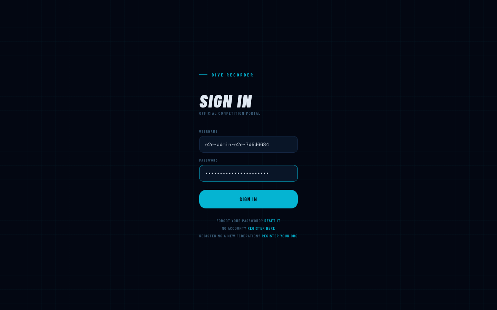

#### Sign Up (individual)

The path for an individual diver, judge, or coach to join an existing federation. Pick the federation from the dropdown, role from the chips, fill in details. New accounts go through email verification and (for non-diver roles) admin approval before they can sign in.

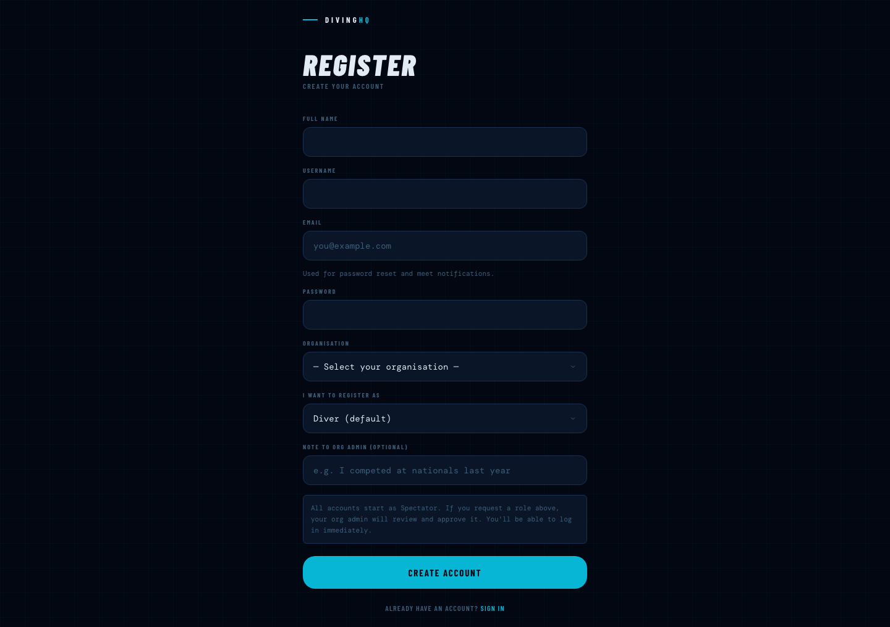

#### Register a Federation

The first-time path for a country federation or club to register an organisation on DivingHQ. Org admin lands here, fills in name + country code + slug + admin credentials, and the request goes to the system administrator's queue for approval before the federation can run meets.

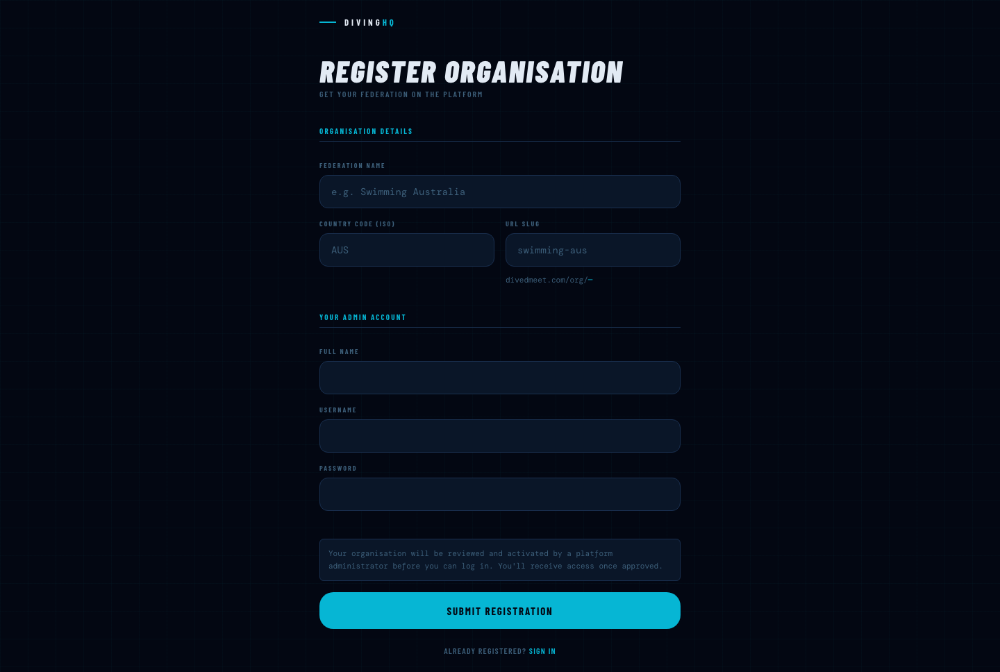

### Spectators + Public Results

#### Public Meet Landing Page

The public hub for a multi-event meet. Federation hero + dates + venue at the top, status counters (`N Live` / `N Upcoming` / `N Completed`), and an event grid grouped by status. Each card jumps to that event's scoreboard or recap. The **📄 Program export…** button at the top opens a chooser to build a printable program: tick which sections to include (event schedule is always on; **Dive lists**, **Judge panels**, and **Estimated event duration** are optional) and pick the per-dive cadence (30 / 45 / 60 seconds) when timing is on. Download as **PDF** for a printed program or **CSV** for spreadsheet ingestion — the CSV uses a `section` column (`event` / `judge` / `dive`) so a federation can filter rows by what they care about.

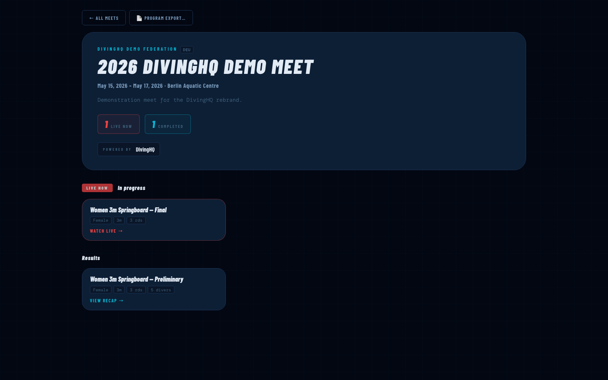

#### Live Scoreboard

What the audience sees while a meet is running. Three-column layout: completed dives on the left (each card shows the diver, country chip, club, dive code + DD + description, and per-judge scores with World Aquatics-category colour-coding); current performer (or on-deck preview) in the centre with a **catch-up projection** below the rank line — the average judge score the active diver needs to overtake the leaders, rounded up to the next achievable 0.5; standings on the right with Final / By Round tabs.

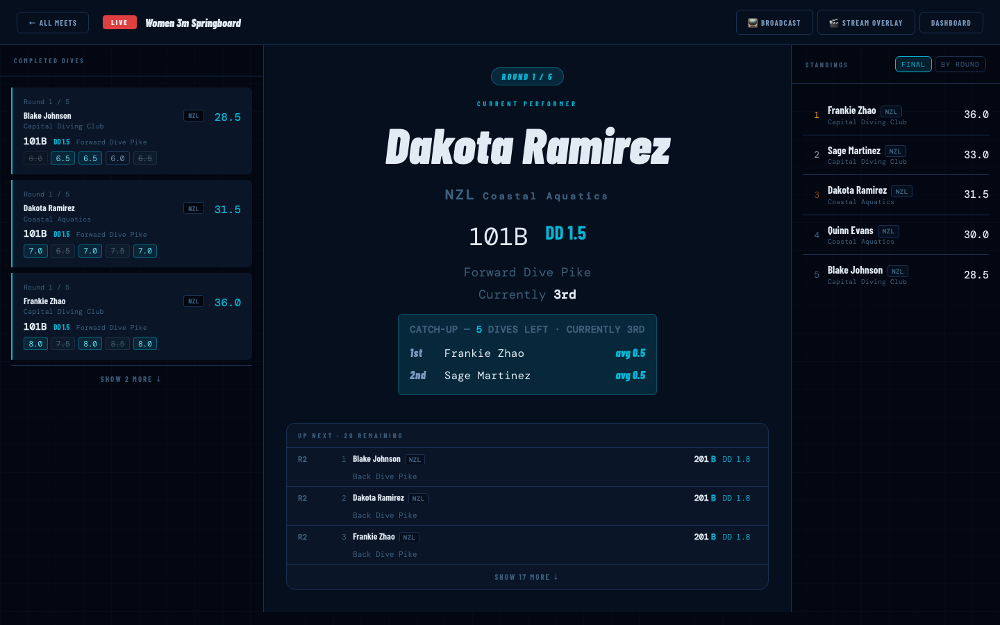

#### Completed Meet Recap

When a meet is over, the Scoreboard switches to a recap layout: podium spotlight, full standings with club + team lines, and a per-diver dive-by-dive breakdown. Per-judge scores are colour-coded by World Aquatics category (excellent → failed) with the trim rule visualised by struck-through dimmed scores. A **Judge Ranking Analysis** card sits between the standings and the highlights panel and renders eagerly on every Completed event — individual, synchro pair, AND team. Each row is a competing entity (diver, pair, or team), each cell shows that judge's hypothetical rank with the hypothetical total on a second line, and every disagreement with the official rank is tinted cyan (pale for a single-position swap, brighter for two or more) so the columns that would have re-shuffled the podium jump out. CSV / PDF exports are one click away from the card header. Hovering a score chip elsewhere on the page also now spells out "Ranked this dive Nth of M in round R" alongside the existing judge identity line. **PDF / CSV / Start List** buttons in the header export the recap in print-ready form.


#### Results Archive

Browse every completed meet across the platform. Filter by country, year, height, club, or just search across event / org / country. Each event card shows competitor and club counts so you can see meet size at a glance, and per-event PDFs (program, start list, score sheet, results) plus a CSV export of the filtered list are one click away.


### Operators (Meet Manager + Org Admin)

#### Dashboard

A **role-aware home** with a tabbed layout. The header carries the user's name + roles plus a top-right account row (diver search box, My Profile, Sign Out). Below the header sits a **Pulse strip** — always-visible, glyph-prefixed cross-role digest reading `🔴 3 LIVE · 📅 2 UPCOMING · 👥 5 PENDING · 🤿 14 days until entries close · ⚖️ 1 judging assignment · 🎓 8 divers coaching · ⚡ Cameron Costa scored 7.5 in 2024 NZL Cup · 4s ago`. Each chip is **clickable** (jumps to the relevant role's tab) and **hoverable** (drops a popover listing the actual items behind the count, each clickable as a deep-link). The LIVE chip *breathes* gently while there are live events; counts that change between polls **flash cyan** so the operator's eye lands on the change. Items in popovers carry **urgency markers** — upcoming events closing within 24h get an amber border + "closing soon" pill; role requests older than 7 days get a red border + "overdue" pill. A **latest-activity ticker** at the right edge auto-cycles every ~9s through the most recent audit rows (hover pauses, click → /audit). The strip is **socket-driven** in real time: `event_status_changed` and `role_request_created` server emits trigger immediate refetches, so the LIVE / PENDING counts update the moment something happens; a 30-second poll stays as a fallback. **Skeleton ghost chips** render briefly on first mount before the real data arrives. Below the pulse strip, a **Tab strip** has one tab per role the user holds and a permanent Other tab for utility surfaces; each tab carries a badge count for pending work in that role. The active panel renders content scoped to the active role: org admins see "What needs your attention" cards (live events, upcoming events sorted by entries-close, pending role requests / org registrations) plus a recent-activity feed plus a go-to grid. Meet managers see their events list + operational tiles. Divers see "Your next meet" + a personal go-to grid. Coaches / judges / referees see their role-scoped content. **Smart-pick** auto-selects the initial tab on mount based on signals (LIVE event for an operator → operator tab; diver with imminent entries close → diver tab; pending governance work → org admin tab; localStorage stamp from a prior visit; most-privileged role fallback). Brand-new federations (zero events + zero clubs) are auto-redirected to `/setup` (the first-run wizard) until they've created a club or dismissed.


#### Meet Manager

The operator's event-configuration surface. Left column is the New Event form (event type, gender, board height, panel size, rounds, optional age group + per-round DD caps). Right column is **status-aware**: each event row's primary action reflects what to do next — `Open Control Room →` for Upcoming, `🔴 LIVE — Open` (subtle pulse) for Live, `View Results` for Completed. Edit / Audit Log / Import Roster / Delete demote into a `⋯` overflow menu so the primary affordance dominates. A **search box + status filter chips** (`Upcoming / Live / Completed`, with per-chip counts) above the list keeps a season's worth of meets scannable. Save a fully-built event configuration as a template once, apply to a new event with one click. Events that bundle into a meet share a public landing page and a printable PDF program.

For age-grouped meets that follow real-world bulletin formats — Diving NSW's "4 dives @ 7.6 from 4 different groups + 4 unlimited from 4 groups" — the form has a **Round structure editor**: define one or more sections, each with its own round count, optional DD-sum cap, and an optional **Min different groups** count. The min-groups field is independent of the section's round count, so an operator can express the canonical "5 dives from 5 different groups" pattern *and* looser variants like "5 dives drawn from at least 4 groups" (one group may repeat). The rules ride on `events.round_rules` (JSONB) and feed the diver portal's live validator + the server's submit-list gate (see migration 038).

The New Event form itself lives in a **modal** (migration 039) that opens via the `+ New Event` button, giving the operator real screen real-estate for the dive list. The legacy "Number of Rounds" dropdown is replaced by a **Round dives** editor: each row is one round, with an autocomplete dive picker (same pattern as the diver portal). Pinning a dive to a row makes it operator-prescribed — every diver in the meet must submit that exact dive in that round, and the diver portal pre-fills + locks the row. Leaving a row blank makes it diver's choice. A "+ Add a new dive…" link inside the picker pops a sub-modal that POSTs straight to `/api/dive-directory` so the operator can add a missing dive without leaving the flow. The Edit Event modal mirrors the same UI — round_rules + round_dives are both fully editable post-create.

Form layout is ordered so the operator's flow reads top-to-bottom: Event Name → Event Type → Gender → **Age Group / Division** → Board height → Judges → **Round dives** → **Round structure** (sections, sat directly under the dives so the operator pins the dives then groups them) → meet bundle / scheduling / format. The **Age Group / Division** dropdown shows the WA Group letter alongside the actual age band so the mapping is visible in one click — *Group D — 11 and under*, *Group C — 12/13*, *Group B — 14/15*, *Group A — 16-18*, plus Masters / Open / Other. The age ranges anchor to PART FOUR Article 13 (Group A 13.2.2; Group B 13.2.1; Group C 13.3.1; Group D extends the WA scheme down per common national-federation usage). A **Suggested templates** strip surfaces World Aquatics-aligned starting points (`src/lib/standard-templates.js`) filtered live by the chosen Gender + Age Group — pick Female + Open and the modal offers Women's 1m/3m/10m and synchro templates that match WA conditions; pick Junior Group A and the Boys/Girls 1m/3m/10m structures load with the right round count + min-distinct-groups rule. Click a template → the form populates, the operator can still tweak any field before submit.

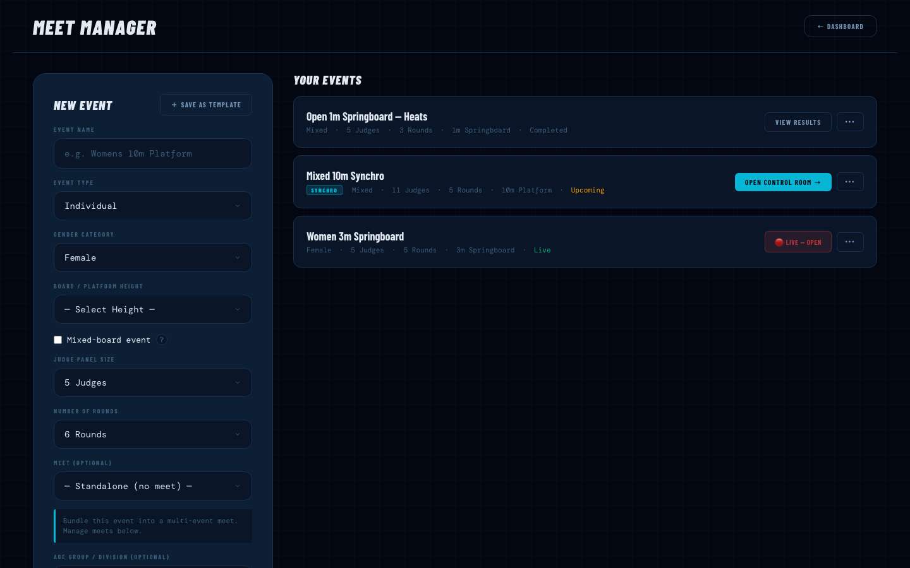

#### Control Room

The operator's cockpit during a live meet, deliberately pared back so only the things you need every dive are visible at rest — secondary actions live behind small popovers. Left column is the running history of completed dives (click any card to open the **Score Correction modal**, which now shows a live preview of trim sum + dive points + delta as you type). Centre column is the active diver — name, country chip, club affiliation, dive code + DD + description, the live judge tile strip, an inline auto-cycling status pill (READY / DIVING / JUDGING), and the 60-second WA post-warning shot clock anchored top-right. The bottom action row reads `← Prev · Adjust ▾ · Next Diver → ▾ · ?` — Adjust houses Failed Dive / Cap Score / Re-Dive; Next Diver's `▾` opens the Auto-next picker; `?` reveals every keyboard shortcut. Right column is **Pre-Meet** at the top (4-pip stepper `✓ Check-in ── ✓ Randomise ── (3) Sign Off ── (4) Start` above the colour-coded workflow button so a new operator sees the whole flow at a glance) plus Up Next visible and Top 5 Right Now + Dive Order panels as collapsed accordions. Clicking the green Start Event button opens the **Pre-Flight Review modal** — last-chance summary of roster / panel / referee status with warnings for misconfigurations (synchro on a 5-judge panel, divers with incomplete dive lists, partial panel). Header `⋯` menu houses Hold / Broadcast mode / Dashboard / Finalise event early (during Live).

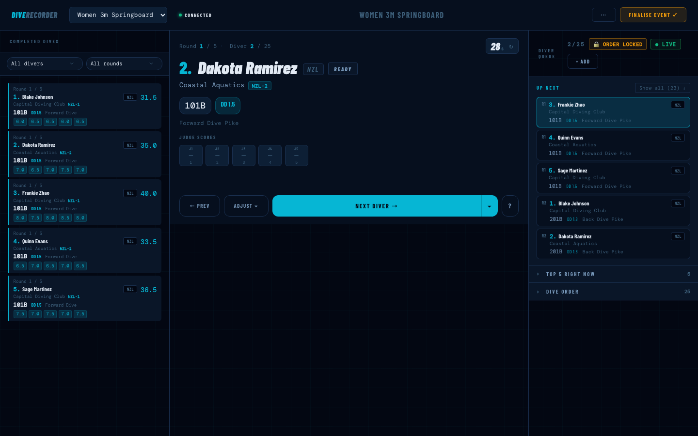

#### Assign Judges

Build the panel for an event: pick judges from the federation's user list, drag to reorder so judge_number aligns with panel position. For synchro events the position-to-role mapping (Exec A / Exec B / Sync) is shown next to each slot so the operator can verify the panel before sign-off.

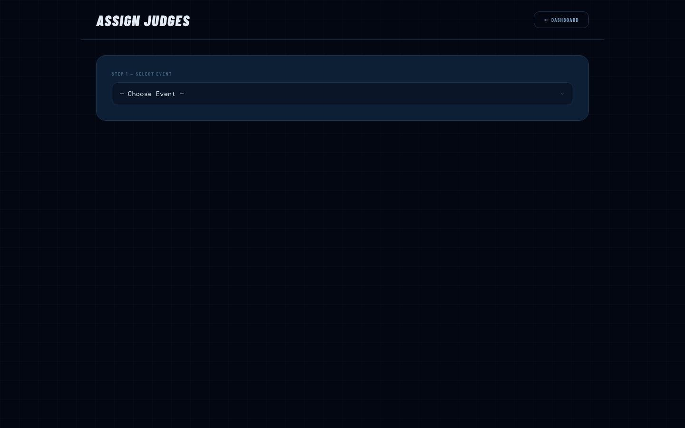

#### Score Audit Log

Per-event timeline of every score insert / update / delete with actor, IP, user agent, old / new value, and reason text. Visible to org admins, referees, and meet managers. 30-day retention by default.

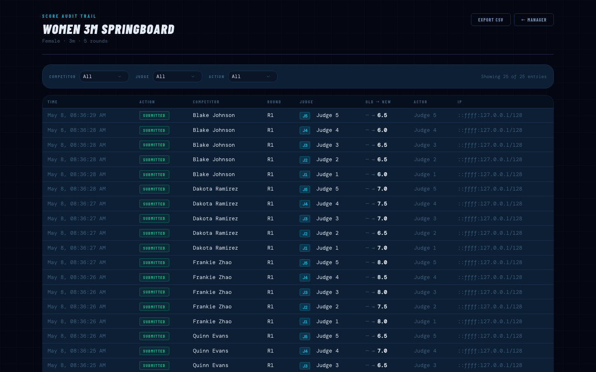

### Judges

#### Judge View

The single-purpose, phone-friendly screen scoring panel members use during a meet. Top zone shows the current diver, their dive code + DD + description, and the panel's progress (`DIVE PANEL · 0 / 5`). Bottom zone is a numeric keypad accepting half-point increments. **Signal Referee** flags the panel for a meet manager hold; **Lock & Submit** sends the score over the socket. For synchro panels, the header also shows the judge's sub-panel role (Exec A / Exec B / Sync) so they know which slot they're filling.

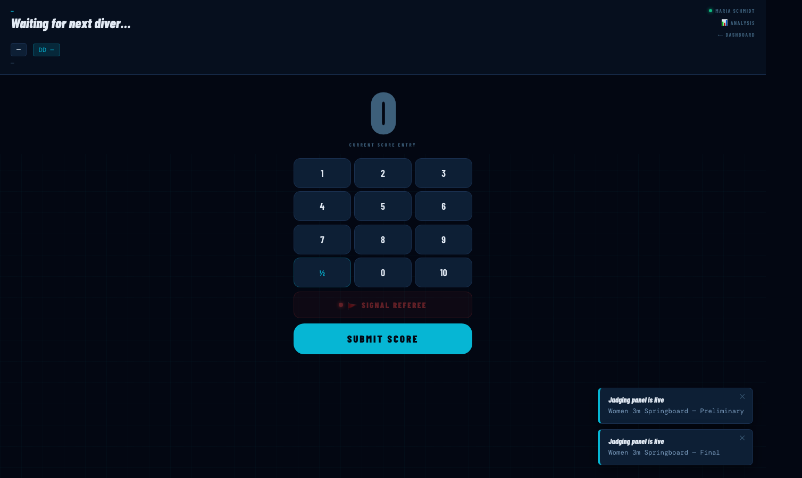

### Divers + Coaches

#### Diver Portal — Submit Dive List

Where divers build their list for an upcoming event. Step 1 picks the event (autocomplete-driven); Step 2 is per-round dive pickers with autocomplete on the dive code (filtered to the event's board height + per-round DD cap), the running Total DD chip, and a single **Finalise & Submit List** button. Saved lists become templates with one click for re-use across meets at the same height.

When the event has **round rules** configured (e.g. Diving NSW–style "4 dives @ 7.6 + 4 unlimited"), the portal shows a per-section strip above the dive picker — running DD total against the section cap and a "n of m groups picked" counter — plus a violations panel beneath the rows that lists which rules are still failing (DD over the limit, repeated group, missing rounds). The **Finalise & Submit** button stays disabled until the list is legal, and the server re-validates on submit so a malformed list can never land in the DB.

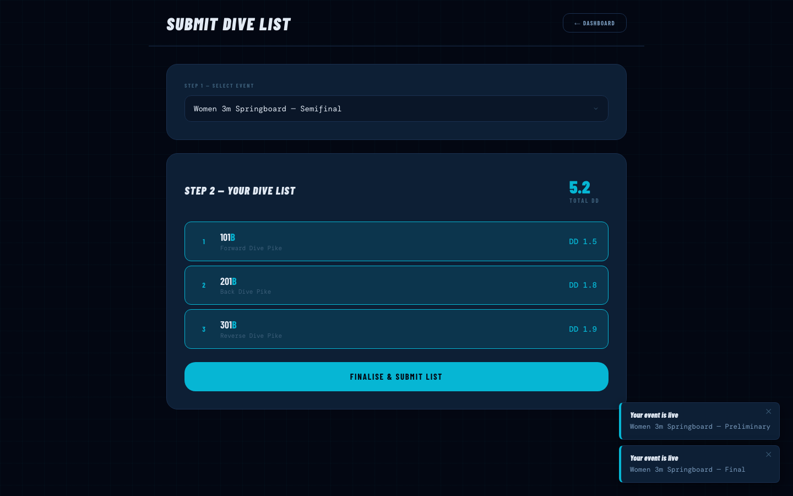

#### Diver Meet Day View

Phone-deck experience for athletes mid-competition. Lives at `/me/meet/:eventId` — surfaced from the dashboard's Diver tab as a pulsing **Meet day · live now** card the moment any event the diver is entered in flips Live. Three blocks stacked vertically, designed for the two minutes between drying off and walking up to the platform:

- **Your next dive** — code (`201B`), description, board height, DD; round pip in the corner; pulsing cyan **YOU'RE UP** banner when the diver is next, otherwise an "N divers until you're up" countdown.
- **Current standing** — rank in 56 px italic cyan with `↑` / `↓` movement, total points, gap to leader (or 🥇 for the leader). World Aquatics-style tied-rank sharing.
- **What you need** — gold/silver/bronze rows colour-coded reachable / achieved / out-of-reach. The per-judge average required (rounded UP to the next 0.5) reuses the same `calc_event_dive_points`-based math the Control Room and audience scoreboard use, so coach + athlete + spectator all see consistent numbers.

Real-time: subscribes to the event-room socket; `score_received` / `state_update` / `score_corrected` trigger a 250 ms-debounced bundle refetch. Endpoint: `GET /api/events/:id/me-meet-day`, gated on `competitor_dive_lists` membership (403s for non-entrants).

#### Diver Profile

Per-diver stats: meets entered, dives performed, average DD attempted, best single dive, an SVG sparkline of total scores across meets, and a personal-bests table keyed by dive code + position + height. The Customize modal lets each diver pick which of 10+ analytics widgets to show (Recent Form, Medal Counts, Height Breakdown, Round-by-Round Form with stamina insight, DD Risk Profile, Compare-to-Peers, Year-over-Year, etc.) — the choices persist per-user. Cmd-P / Ctrl-P prints the dashboard to PDF; `/compare?a=&b=` puts two divers side-by-side.


#### Compare Two Divers

Side-by-side at `/compare?a=<id>&b=<id>` — two divers' headline stats in two columns, plus a per-dive PB diff for every dive code + position both have attempted. Useful before national selections or for coaches comparing rivals.

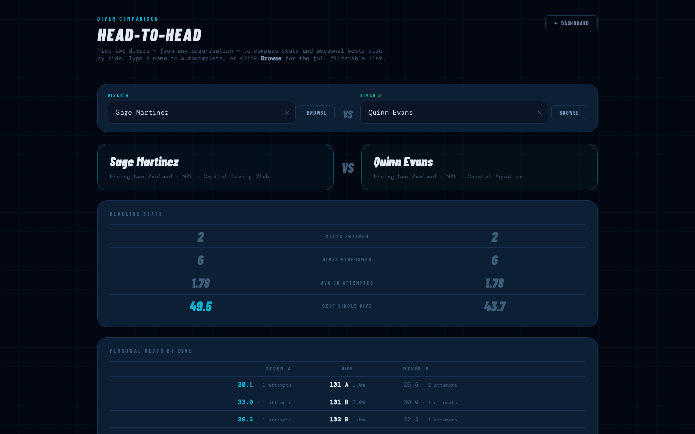

#### Coach Dashboard

A coach's hub: their roster of linked divers (subject to org-admin approval) with one-click access to each diver's profile + analytics. Templates the coach saves on a diver's behalf are scoped per board height and per diver.

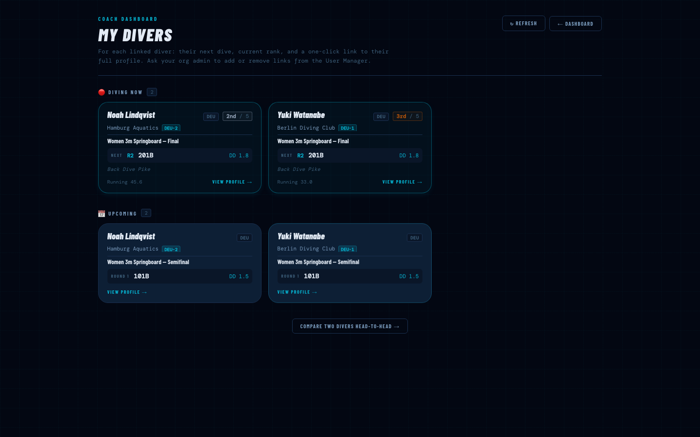

### Admins

#### User Manager

Search across the federation's users; filter by role chips and (system admins only) by org; bulk-apply roles by ticking rows; click any row to open the edit drawer with profile, roles, role-audit history, club assignment, and (for divers) coach links. The token-version bump on every role change forces the affected user to re-login the next request.

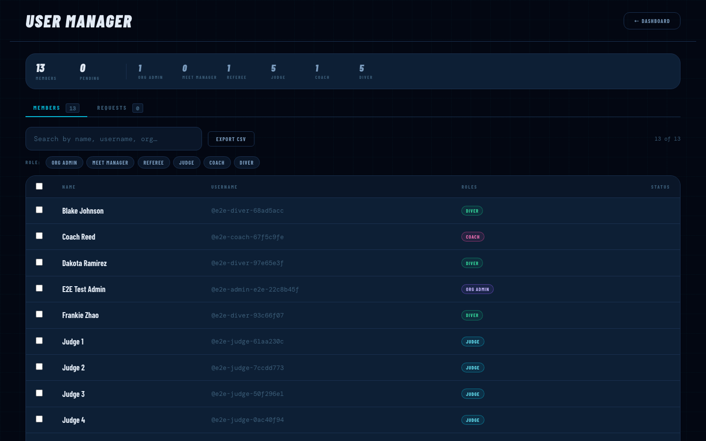

#### Clubs

The federation's club registry. Each club has a name + a 3 – 6 char short code (the cyan pill that surfaces next to the diver's name on the scoreboard). Members count is derived from `users.club_id`; non-empty clubs can't be deleted (prevents orphaning users).

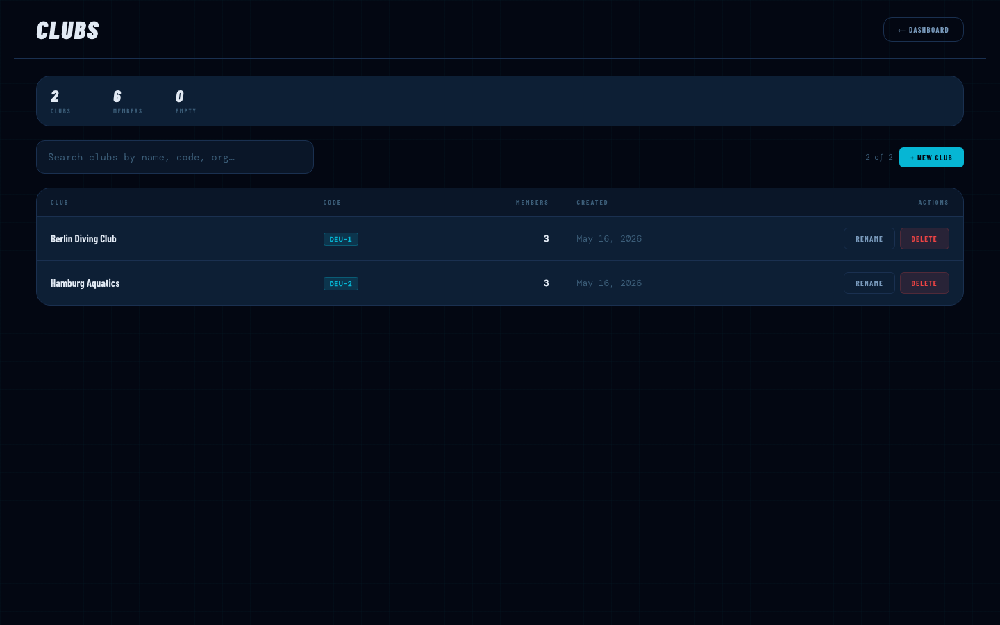

#### Teams

Teams sit alongside clubs as a separate grouping for World Aquatics Team Event entries. A diver can belong to multiple teams over time. Soft-delete preserves the team's history (existing dive lists keep referencing the team via `ON DELETE SET NULL`).

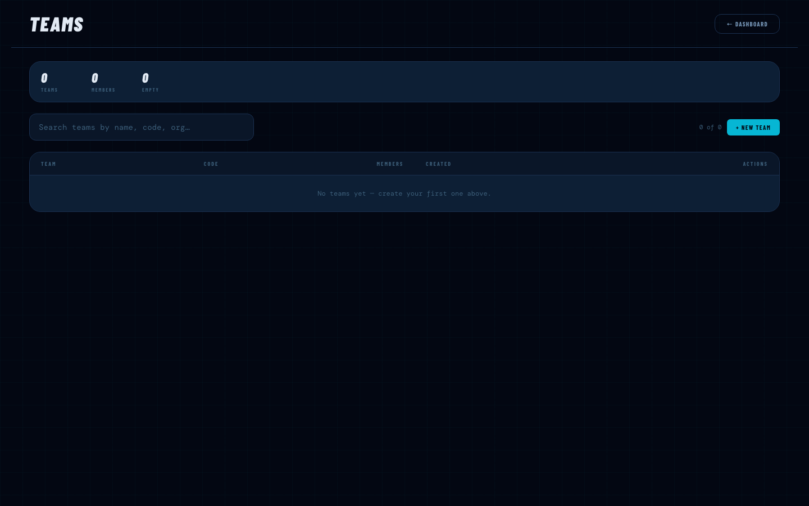

#### Dive Directory

Browse the World Aquatics catalogue (~830 dives shipped in `init.sql`) and add custom rows for poolside / progression / age-group dives. Filter by group, position, height, gender. Custom rows are scoped per-org; standard rows are read-only.

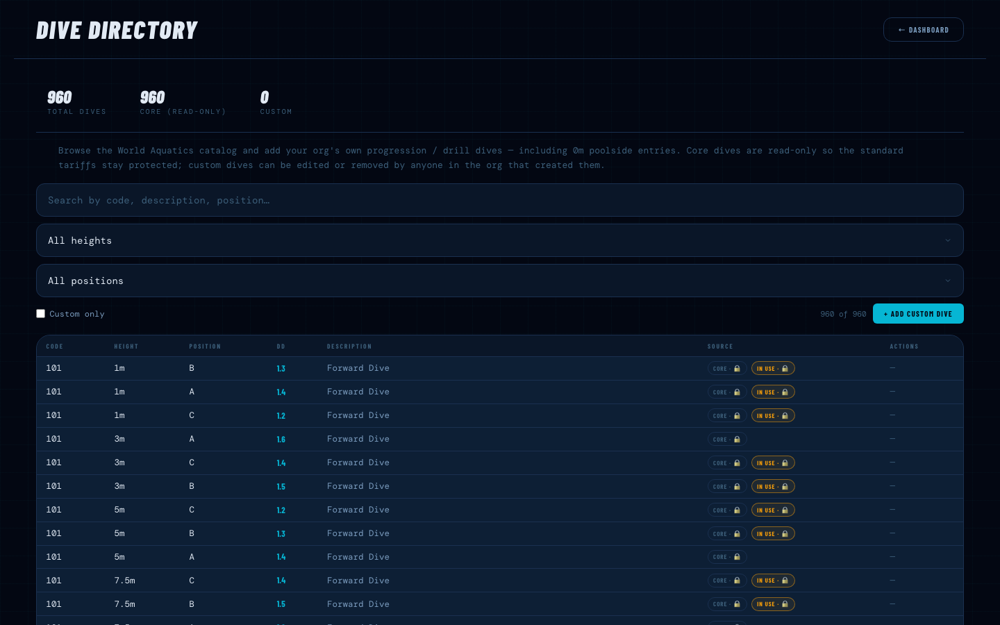

#### Sign-Off Codes (Referee)

The referee's sign-off page. Pre-meet, the meet manager generates a 6-digit handoff code on their device; the referee opens this page on their phone and types the code to authorise the panel. Both legs write the same audit row regardless of which path the operator picked.

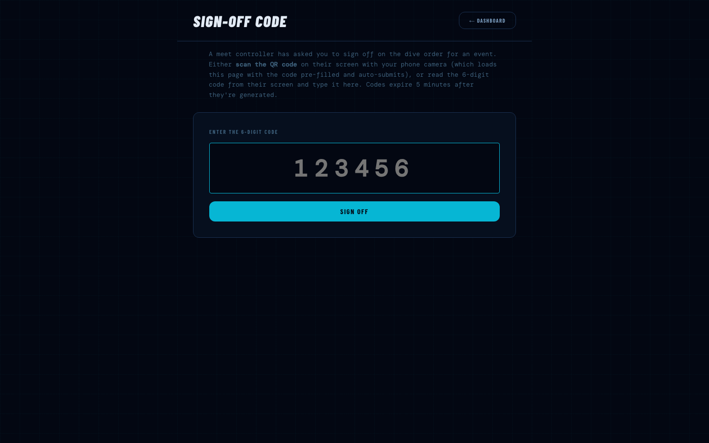

---

</details>

<details>
<summary><h2 id="tech-stack">Tech stack</h2></summary>

- **Frontend**: Vue 3 (Composition API, `<script setup>`), Vite 6, Vue Router, Pinia, vue-i18n@11 (25 locales, build-time AST precompilation via `@intlify/unplugin-vue-i18n` so no eval-based message compiler ships to the browser — keeps the strict `script-src 'self'` CSP intact)
- **Backend**: Node 18+, Express 5, Socket.IO 4, [`pg`](https://node-postgres.com/), `pdfkit`, `nodemailer`
- **Auth**: JSON Web Tokens, bcrypt password hashing, password-reset email flow with single-use tokens
- **Database**: PostgreSQL 14+ with `uuid-ossp` and `pgcrypto`
- **PWA**: service worker (network-first navigation + cache-first assets), web app manifest, IndexedDB-backed offline caching

The project intentionally avoids a build-time framework like Nuxt or Next — the SPA is plain Vite, the server is a single Express app split into thin route modules. Easier to read end-to-end.

---

</details>

<details>
<summary><h2 id="features">Features</h2></summary>

The complete feature inventory now lives in the wiki, with two views over the same set of features:

- **[Features → By persona](https://github.com/JediBrooker/DivingHQ/wiki/Features#by-persona)** — pick your role (Spectator / Diver / Judge / Referee / Coach / Meet manager / Org admin / System admin) and see everything you can do, with deep-links to the docs for each one.
- **[Features → By section](https://github.com/JediBrooker/DivingHQ/wiki/Features#by-section)** — same features inverted, grouped by app surface (Auth, Meet setup, Control Room, Judging, Scoreboard, Diver Portal, Admin Tasks, PDF/CSV exports, Notifications, Keyboard shortcuts, Performance + offline).

The README used to inline this list; the wiki page keeps deep-links to the user guide and is easier to keep in sync as features land.

The app also ships a venue hardware bridge for Daktronics workflows:
`npm run venue:daktronics` subscribes to the existing
`venue.scoreboard_state` payload and writes fixed-width RTD or JSON frames
to UDP, TCP, stdout, files, or a serial device. See
[`docs/venue-daktronics-bridge.md`](./docs/venue-daktronics-bridge.md).

---

</details>

<details>
<summary><h2 id="languages">Languages</h2></summary>

DivingHQ ships with **25 supported languages** — English source plus 24 translations. A flag-prefixed dropdown in the header on the Home page, the Login page, and the Dashboard lets any user switch language. The choice persists to `localStorage`, applies to every page in the app, and survives sign-in / sign-out.

| Region | Languages |
|---|---|
| 🌍 Western Europe | 🇬🇧 English · 🇪🇸 Spanish · 🇫🇷 French · 🇩🇪 German · 🇮🇹 Italian · 🇵🇹 Portuguese |
| 🌍 Northern Europe | 🇫🇮 Finnish · 🇸🇪 Swedish · 🇩🇰 Danish · 🇳🇴 Norwegian |
| 🌍 Central / Eastern Europe | 🇵🇱 Polish · 🇭🇷 Croatian · 🇷🇸 Serbian · 🇭🇺 Hungarian · 🇬🇷 Greek · 🇹🇷 Turkish |
| 🌍 East Slavic | 🇷🇺 Russian · 🇺🇦 Ukrainian |
| 🌏 East Asia | 🇨🇳 Mandarin Chinese · 🇯🇵 Japanese · 🇰🇷 Korean |
| 🌏 Southeast Asia | 🇮🇩 Bahasa Indonesia · 🇲🇾 Bahasa Melayu · 🇵🇭 Tagalog |
| 🌍 Middle East | 🇸🇦 Arabic *(RTL — full right-to-left layout flip)* |

### How it works

- **Source of truth**: `src/locales/en.json` (~459 keys grouped into per-page namespaces — `auth.*`, `home.*`, `dashboard.*`, `coach.*`, `scoreboard.*`, `control.*`, `manager.*`, etc.). Every other locale file has an identical key shape (verified programmatically in CI — 25 × 459 = 11,475 strings, zero structural drift).
- **No runtime eval**: `@intlify/unplugin-vue-i18n` precompiles every JSON dictionary into AST functions at build time so the browser never invokes vue-i18n's parser. This keeps the strict `script-src 'self'` CSP intact (the alternative — runtime JIT compilation — uses `new Function` and gets blocked).
- **RTL handling**: Arabic carries an `rtl: true` flag in `SUPPORTED_LOCALES`; `setLocale()` syncs `<html dir="rtl">` and `<html lang="ar">` in lockstep with the i18n state. The existing layout uses logical CSS (flex, `padding-inline-end`, `inset-inline-end`) so the whole page mirrors cleanly without per-component changes.
- **First-visit auto-detect**: `navigator.language` prefix is matched against `SUPPORTED_LOCALES` on first visit — a phone set to `fr-FR` lands on French, set to `ja` lands on Japanese, etc. Falls back to English.

### Adding more languages or refreshing translations

A Node script wraps the Anthropic API for AI-assisted translation work:

```bash
# Translate any new English keys into every locale at once
ANTHROPIC_API_KEY=sk-… npm run translate

# Refresh a subset of locales
ANTHROPIC_API_KEY=sk-… npm run translate -- --locales fr,de,zh

# Side-file mode — writes .new.json next to each locale so you can
# diff + proofread before promoting
ANTHROPIC_API_KEY=sk-… npm run translate -- --diff
```

The script is idempotent — already-translated keys are skipped unless `--force` is passed, and the JSON structure / placeholders / `{'@'}` escape sequences are preserved verbatim.

For deeper detail (vue-i18n message format, the unplugin alternative builds, how the locale state hydrates), see the wiki: [Languages & Translation ↗](https://github.com/JediBrooker/DivingHQ/wiki/Languages).

---

</details>

<details>
<summary><h2 id="local-setup">Local setup</h2></summary>

### 1. Prerequisites

- **Node 18 or newer** (Vite 6 requires it)
- **PostgreSQL 14+** running locally
- The `uuid-ossp` and `pgcrypto` extensions (PostgreSQL ships with them; `init.sql` enables both)

### 2. Clone and install

```bash
git clone https://github.com/JediBrooker/DivingHQ.git
cd DivingHQ
npm install
```

### 3. Create and initialise the database

```bash
createdb divinghq
psql -d divinghq -f init.sql
```

`init.sql` is the single bootstrap script — it creates every table, enum, function and index, loads the full World Aquatics dive directory (~830 dives), and creates a system-admin account so you can sign in immediately. Schema version is logged on server boot.

### 4. (Optional) Seed test data

```bash
psql -d divinghq -f seed_test_data.sql
```

Adds 20 country federations, 80 clubs, 1000 users, 50 individual events, 20 synchronised pair events (11-judge panels with proper World Aquatics scoring) and 10 team events (3 teams of 4 members each), all with dive lists, judge scores, and matching audit history. Useful for stress-testing the archive, scoreboard, and admin views. Idempotent — safe to re-run; deletes the prior seed before re-inserting.

### 5. Configure environment

```bash
cp .env.example .env
# edit .env with your local DB credentials and a JWT secret
```

For password-reset and notification emails to actually send, also configure SMTP:

```
APP_BASE_URL=https://your-domain.example.com
SMTP_HOST=smtp.your-provider.com
SMTP_PORT=587
SMTP_USER=...
SMTP_PASS=...
SMTP_FROM="DivingHQ <noreply@your-domain.example.com>"
```

Without `SMTP_HOST` set, every email helper silently no-ops — registrations and password changes work, just no email is dispatched. `APP_BASE_URL` is used to build the reset-password link AND the referee sign-off code QR/deep-link; the server refuses to issue a sign-off code when it isn't set, so make sure the value is configured in production.

### 6. Sign in

| Account | Username | Password |
|---|---|---|
| System administrator (created by `init.sql`) | `admin` | `admin` |
| Any seeded test user (created by `seed_test_data.sql`) | `bulk_user_0001` … `bulk_user_1000` | `password123` |

Change the `admin` password from the User Manager once you're in.

### 7. Run

In two terminals:

```bash
# Terminal 1 — backend on :3000
npm start

# Terminal 2 — Vite dev server on :5173 (proxies /api and /socket.io to :3000)
npm run dev
```

For a production-ish single-process build:

```bash
npm run build      # builds the SPA into dist/
npm start          # Express serves the API and the dist/ SPA together
```

Open `http://localhost:5173` (dev) or `http://localhost:3000` (built).

---

</details>

<details>
<summary><h2 id="production-deploy">Production deploy</h2></summary>

The repo ships everything you need to run on a real server: a checked-in PM2 ecosystem file, a deploy script that fails closed at every step, and a `/api/health` endpoint for monitors.

### First-time setup on a fresh box

After cloning, installing deps and getting `init.sql` loaded (steps 1–6 above), bring the service up under PM2:

```bash
pm2 start ecosystem.config.js
pm2 save                                  # persist the process list
pm2 startup                               # prints a sudo command — run it
                                          # to register PM2 with systemd

# Log rotation — PM2 appends to logs/pm2-out.log forever by default.
pm2 install pm2-logrotate
pm2 set pm2-logrotate:max_size 10M
pm2 set pm2-logrotate:retain 7
```

`ecosystem.config.js` runs the app as a single fork process named `dive-recorder` with a 512MB memory ceiling, restart-on-crash, and combined stdout/stderr logs in `./logs/`. **Don't enable PM2 clustering** without first wiring up a Socket.IO adapter (Redis or `@socket.io/cluster-adapter`) and moving the in-memory `activeDivers` / `meetHolds` maps out of the node process — clustering without those would split-brain the live-scoring state across workers.

### Subsequent deploys

```bash
./deploy.sh
```

The script:

1. `git pull --ff-only` (refuses non-fast-forward merges)
2. `npm ci` (deterministic install from the lockfile)
3. `npm test` (catches TDZ / boot regressions via the boot test)
4. `npm run build` (builds before migrate so a broken build doesn't leave the DB advanced past code we can't ship)
5. `npm run migrate -- --dry`, then real migrate
6. `pm2 restart dive-recorder`
7. Polls `/api/health` for up to 10s; fails the script if the service didn't come back up, and prints the rollback command (`git reset --hard <prev-sha> && pm2 restart dive-recorder`)

Flags:

| Flag | When |
|---|---|
| (none) | normal deploy |
| `--dry` | preview every step without writing |
| `--skip-tests` | emergency hotfix path; tests skipped but build + health check still gate |

### Health checks + monitoring

`GET /api/health` returns `{ ok: true, schema_version }` on success or `503 { ok: false }` if the DB pool can't issue a trivial query. No auth — point any uptime monitor (UptimeRobot, BetterStack, etc.) at `https://your-domain/api/health` on a 60s interval.

### Rolling back a bad deploy

If `deploy.sh` fails the health check it prints the exact rollback command:

```bash
git reset --hard <previous-sha>
pm2 restart dive-recorder
```

Migrations in this repo are **additive only** (`ADD COLUMN`, `CREATE INDEX`, `ADD CONSTRAINT IF NOT EXISTS`) so leaving them applied during a code rollback is safe — the old code keeps working against the new schema. If a future PR ever needs a destructive change (drop column, rename), do it as a two-deploy dance: ship the code that works against both shapes first, then the migration in a follow-up release.

---

</details>

<details>
<summary><h2 id="project-structure">Project structure</h2></summary>

```
.
├── server.js                       # 650-line bootstrap shell — pool, middleware,
│                                   # factory mounts for 19 route modules,
│                                   # /api/health, SPA fallback, listener
│
├── routes/                         # Every API surface, one module per concern.
│   │                               # Each file exports a factory that takes the
│   │                               # deps it needs and returns an Express router.
│   ├── auth.js                     # /api/auth/* (login, register, verify-email,
│   │                               # forgot/reset password)
│   ├── orgs.js                     # /api/orgs/*, /api/clubs/*, per-org divers
│   ├── teams.js                    # team CRUD + members + dive-lists + event_teams
│   ├── coach.js                    # /api/coach/dashboard, /divers, link admin
│   ├── meets.js                    # meet CRUD + event-to-meet assignment
│   ├── users.js                    # user listing + role grants + role requests
│   ├── events.js                   # event CRUD + status flips
│   ├── event-staff.js              # event managers + judge panel + per-judge views
│   ├── control-room.js             # roster + reorder + randomise + check-in + CSV
│   ├── scoreboard.js               # /api/scoreboard/:eventId + /leaderboard
│   ├── score-correction.js         # PUT /api/scores/:id + /api/events/:id/score-audit
│   ├── archive.js                  # public results archive
│   ├── pdf.js                      # 4 PDFs (program, start-list, score-sheet,
│   │                               # results) + 1 CSV export
│   ├── diver-profile.js            # /api/divers/:id/profile + /analytics + dashboard
│   ├── diver-search.js             # cross-org diver autocomplete + browse
│   ├── competitor.js               # POST /api/competitor/submit-list
│   ├── templates.js                # per-diver dive-list templates
│   ├── dive-directory.js           # GET /api/dive-directory
│   └── socket.js                   # every io.use / socket.on handler
│
├── lib/                            # Shared backend modules consumed by routes/*.
│   ├── middleware.js               # verifyToken, requireOrgRole, event gates,
│   │                               # token-version cache, score validation
│   ├── email.js                    # send-* helpers + bcrypt-hash fingerprint
│   ├── records.js                  # checkAndApplyRecords + GET /api/records
│   ├── live-state.js               # activeDivers + meetHolds maps (single-process)
│   ├── scoreboard-cache.js         # 5s TTL with explicit invalidation on commits
│   └── public-id.js                # opaque id hashing for spectator UI
│
├── db/queries.js                   # Reusable SQL CTE strings (PER_DIVE,
│                                   # FULL_FIELD_RANKING) shared by analytics +
│                                   # archive queries
│
├── init.sql                        # One-shot bootstrap: every table + enum +
│                                   # function + index + the dive directory
│                                   # (~830 rows) + the system-admin account.
│                                   # Stamps schema_meta to the current version.
├── seed_test_data.sql              # Optional: 20 federations, 80 clubs,
│                                   # 1000 users, 80 events, 18k scores. Idempotent.
├── migrations/                     # Append-only schema changes (008 onwards).
│                                   # Each is idempotent (CREATE … IF NOT EXISTS,
│                                   # backfills gated on DO blocks).
│
├── scripts/migrate.js              # Migration runner — reads schema_meta.version,
│                                   # applies pending files in order. Wraps each
│                                   # file in its own txn. --dry / --to N flags.
│
├── deploy.sh                       # Production deploy script: pull → npm ci →
│                                   # npm test → npm run build → npm run migrate →
│                                   # pm2 restart → /api/health probe. Fails the
│                                   # script (with rollback hint) on any step.
├── ecosystem.config.js             # PM2 config — single fork process, 512MB
│                                   # memory ceiling, restart-on-crash. Notes
│                                   # why we don't cluster (Socket.IO + in-memory
│                                   # state would split-brain).
│
├── src/                            # Vue 3 SPA (Vite, Composition API)
│   ├── views/                      # One Vue component per route
│   ├── components/                 # Shared building blocks
│   ├── composables/                # useSocket, useOfflineApi, useScoreCategories,
│   │                               # useScoreTrim
│   ├── stores/auth.js              # Pinia auth store (apiFetch helper, 401 →
│   │                               # /login redirect, JWT in sessionStorage)
│   ├── lib/idbCache.js             # IndexedDB stale-while-revalidate helper
│   ├── router/index.js             # vue-router config
│   └── main.js, App.vue
│
├── public/
│   ├── css/app.css                 # Shared design tokens (one stylesheet)
│   ├── icon.svg / icon-*.png       # PWA icons
│   ├── manifest.webmanifest        # Web app manifest
│   └── sw.js                       # Service worker (network-first navigation,
│                                   # cache-first hashed assets)
│
├── test/                           # Node test runner — `npm test` runs all four.
│   ├── syntax.test.js              # Parser + boot test (catches TDZ /
│   │                               # missing-binding regressions) + schema
│   │                               # version pin + scoreCategory boundaries
│   ├── calc.test.js                # World Aquatics scoring tests vs Postgres
│   ├── score-trim.test.js          # Trim algorithm parity (matches the
│   │                               # SQL function across 3/5/7/9/11 panels)
│   └── integration.test.js         # End-to-end: register-org → login →
│                                   # event create → analytics → recent_form
│                                   # ranking regression (#67a5708)
│
├── logs/                           # PM2 log target (gitignored content;
│                                   # directory committed for first-boot)
│
└── .github/
    ├── workflows/ci.yml            # Lint + build + Postgres test matrix
    └── ISSUE_TEMPLATE/bug_report.md
```

The split is the result of an incremental refactor from a single 6,400-line `server.js` to the current 650-line shell + 19 route modules + 6 lib modules. Every module is independently mountable; the `Phase N of server.js split` commits in the git history walk through each extraction with tests passing between every step.

---

</details>

<details>
<summary><h2 id="roles">Roles</h2></summary>

DivingHQ has eight role personas — seven values in the `org_role` enum plus the `is_system_admin` boolean flag. Each persona below describes the role's context and the things that role can actually do in the app.

### `is_system_admin` — Platform operator

The platform operator runs DivingHQ as a multi-tenant SaaS — the only person who sees across every federation on the system. They're the last line of defence when something goes wrong, whether that's a stuck migration, a suspicious score change, or an org admin who's locked themselves out the morning of a national championship. Their authority is orthogonal to `org_role`: not "in" any single org, but above all of them.

**What they can do:**
- Approve or reject new federation sign-ups (`/api/orgs/pending`)
- Run database migrations and inspect `schema_meta` to confirm the deployed version
- Read `score_audit_log` and `role_audit_log` across every org
- See every event in every org via `/api/events` (no org filter)
- Override the org filter on read endpoints (e.g. edit any event regardless of `org_id`)
- Reset passwords and unlock accounts for any user

### `org_admin` — Federation administrator

Top of the food chain inside one federation — the person whose name is on the records book. They don't typically run meets themselves, but they decide who does: promoting meet managers, certifying judges, approving coach-diver links. They care about the integrity of the records and the credibility of the scoreboard when sponsors look at it.

**What they can do:**
- Create events and meets (`POST /api/events`, `POST /api/meets`)
- Promote, demote, and remove org roles within their federation
- Approve or reject coach⇄diver linking requests
- Edit or delete any event in their org
- Set `entries_close_at` on events to enforce registration deadlines
- Sign off federation records (`records_federation`)
- Manage clubs and teams within the federation

### `meet_manager` — Meet organiser

The person actually running the meet on the day. They live in ControlView for those eight hours: starting every event on time, keeping the queue clean, and surviving the inevitable late-arriving diver without the controller crashing.

**What they can do:**
- Schedule events (`scheduled_at`) and set the registration deadline (`entries_close_at`)
- Import the roster from CSV (`POST /api/events/:id/roster/import`)
- Lock the dive order, drag-reorder before the event starts, randomise starts
- Drive ControlView during the meet — advance divers round-by-round
- Flip event status: `Upcoming → Live → Completed`
- Add a late-arriving diver via the late-entry override (works after entries close)
- Edit a team's bulk dive list (`POST /api/teams/:teamId/dive-lists`)
- Withdraw or scratch divers mid-event

### `referee` — Meet official

The licensed official on deck. They don't score dives themselves — they supervise the panel that does. They confirm the right number of judges are seated, watch the scoreboard for anomalies during the meet (a judge drifting two points low across the panel, a missed drop), and adjudicate when a coach challenges a score.

**What they can do:**
- View the live ScoreboardView for any event they're assigned to
- Read the per-event `score_audit_log` to see who entered or changed each score
- Authorise a score correction (the audit row records them as the actor)
- Confirm synchro panels have valid exec/sync subgroups (9 or 11 judges)
- See the full panel composition in `event_judges` before the event starts

### `judge` — Scoring panel member

Part-time scoring staff who work meet by meet. Usually on a phone in landscape — watching the diver, tapping a score, moving on. The app's single job for them is to make scoring frictionless.

**What they can do:**
- Log into JudgeView on phone for any event they're assigned to (`event_judges`)
- See the current diver, their dive code, position, and DD as it changes round by round
- Tap a half-point score (0.0 → 10.0) on the dial
- Submit the score over the socket (rate-limited per-judge to prevent double-taps)
- See their own submitted score reflected immediately

### `coach` — Diver mentor

Works most closely with individual diver data. Spotting trends — a 5132D drifting two judges down over three meets — comparing two divers head-to-head before nationals, and saving dive-list templates so a 3m optionals list isn't retyped every weekend.

**What they can do:**
- Request to be linked to a diver via `coach_diver_links` (subject to org admin approval)
- View each linked diver's full profile: recent form, judges' individual scores, PB by board height
- Compare two divers head-to-head in CompareView
- Save and re-use dive-list templates, scoped per board height
- See historical scores at the dive-code-and-position level (e.g. their last ten 105Bs)

### `diver` — Athlete

Phone-native and impatient — the app needs to get out of their way. The night before each meet they submit their list; during the meet they watch their own scoreboard between rounds and review judges' scores after each round to calibrate against the panel.

**What they can do:**
- Submit a dive list for an event (`POST /api/competitor/submit-list`) — only while the event is `Upcoming` *and* `entries_close_at` hasn't passed
- Save the current list as a named template, scoped to the event's board height
- Load a saved template and tweak before submitting
- Pick a synchro partner via the autocomplete (filters fellow divers in the org)
- Watch the live ScoreboardView for any event they're in
- Review own profile: recent form, individual judges' scores, PBs by board height

### `spectator` — Public viewer

Friends, family, sponsors. Often anonymous — no account, no token. Frequently watching from a phone on patchy 4G. The app's job for them is zero-friction live spectating.

**What they can do:**
- Open the public scoreboard URL with no login required
- Watch scores update live over the socket as judges submit
- See only events in `Live` or `Completed` status (anonymous filter on `/api/events`)
- See published records (`records_personal`, `records_club`, `records_federation`)
- *Cannot* see anyone's dive list before the event goes Live — that's locked to authenticated users

### Summary

| Role enum | Tenancy | Primary surface | Headline capability |
|---|---|---|---|
| `is_system_admin` | Cross-org | Admin console + audit logs | Operate the platform across every federation |
| `org_admin` | One org, full control | ManagerView | Run the federation: events, roles, records, deadlines |
| `meet_manager` | Events they manage | ManagerView + ControlView | Run the meet on the day, including late-entry override |
| `referee` | Per-event assignment | ScoreboardView + audit log | Defend panel integrity, authorise score edits |
| `judge` | Per-event assignment | JudgeView (phone) | Score dives over the socket |
| `coach` | Linked divers | DiverProfileView + CompareView | Track diver form, compare divers, manage templates |
| `diver` | Self + linked coach | CompetitorView | Submit dive lists, manage templates, watch own results |
| `spectator` / anonymous | Public | ScoreboardView | Zero-friction live spectating |

System admin is set with a SQL `UPDATE` (no UI for it intentionally — it's a powerful flag):

```sql
UPDATE users SET is_system_admin = true WHERE username = 'your_username';
```

Sign out and back in for the change to take effect (the JWT carries the flag). The bootstrap `admin` user already has the flag set.

---

</details>

<details>
<summary><h2 id="reporting-a-bug">Reporting a bug</h2></summary>

Bug reports go through GitHub Issues. The repo has a template that prompts for the details that actually help debug — please fill in everything you can.

**To file a bug:**

1. Open https://github.com/JediBrooker/DivingHQ/issues/new/choose
2. Pick the **Bug report** template.
3. Fill in the sections (steps to reproduce, expected vs actual, environment).
4. **Don't paste passwords, JWTs, or other secrets.** If a JWT helps the diagnosis, redact the signature segment.

**Before filing**, a quick triage that solves most issues:

- **White page after a deploy?** Hard refresh (Cmd-Shift-R / Ctrl-Shift-R) once. The service worker is now network-first so subsequent deploys reach you on a normal refresh.
- **Schema-version errors?** On the server, check the boot log for `📊 Schema version N`. If `N` is lower than the current migration count under `migrations/`, run the missing migrations in order.
- **Email not sending?** `SMTP_HOST` must be set in the env. Without it, every email helper silently no-ops.
- **Live scoring not updating?** Check the **Connection-lost banner** at the top of the Judge / Scoreboard view — if it's showing, the socket is disconnected.

If you're a paying customer or running a production federation, urgent issues can be flagged via email — see `SUPPORT.md` (if present) for the escalation path; otherwise the issue tracker is the canonical channel.

---

</details>

<details>
<summary><h2 id="scripts">Scripts</h2></summary>

| Command | What it does |
|---|---|
| `npm install` | Install dependencies |
| `npm run dev` | Vite dev server on :5173 with HMR; proxies `/api` and `/socket.io` to :3000 |
| `npm run build` | Build SPA to `dist/` |
| `npm run preview` | Vite preview of the built bundle |
| `npm start` | Run the Express server (serves `dist/` if built; serves the API and WebSocket on :3000) |
| `npm run lint` | Syntax-check `server.js` |
| `npm test` | Node's built-in test runner against `test/*.test.js` |
| `npm run test:e2e` | Playwright end-to-end suite — see below |
| `npm run venue:daktronics` | Run the Daktronics RTD/ERTD venue bridge CLI |

---

</details>

<details>
<summary><h2 id="end-to-end-tests">End-to-end tests</h2></summary>

Eight Playwright specs live under `test/e2e/`. They boot a real
Express server on `:3097` (set via the `webServer` block in
`playwright.config.js`), point Chromium at it, and drive the SPA
through full user journeys. Each test creates an isolated org +
admin per run via `_setup.createOrgAndAdmin`, then deletes the
org in cleanup so parallel runs don't collide.

### The specs

| Spec | What it exercises |
|---|---|
| `smoke.spec.js` | Health endpoint, SPA boots, `/metrics`, public diver profile fall-through, OG-tagged HTML for crawler UAs |
| `scoring.spec.js` | Five judges submit scores via `socket.io-client`; `/api/scoreboard` reflects the trimmed total. Catches regressions in the socket layer, the trim algorithm, and the standings query |
| `admin.spec.js` | Org admin creates an event, late-adds a diver to the roster, flips Upcoming → Live → Completed |
| `competitor.spec.js` | Diver self-registers, login is blocked with `code: "email_not_verified"`, verify-then-login works, diver submits a 2-round dive list |
| `2fa.spec.js` | TOTP setup → confirm → two-step login → recovery-code login → disable. Recovery codes are one-time |
| `scoreboard-ui.spec.js` | UI-driven simulation of a 3-diver × 3-round meet. Login → `/scoreboard/<id>` → live judge tiles fill with each socket event → standings re-sort → Completed flip → recap renders |
| `meet-manager.spec.js` | Full meet-manager pipeline. Login → `/control` → pick event → walk the 4-state pre-meet workflow button (red Check In → orange Randomise → yellow Sign-Off → green Start) → judges score over 3 rounds × N divers as the admin clicks "Next Diver →" between dives → Finalise → recap. Yellow Sign-Off step opens the modal and exercises the **credential** path: a referee user (created in setup) types their username + password on the manager's screen and the server stamps `signed_off_by = referee.id`. Random `event_type` per run (individual / synchro_pair / team); synchro defaults to **11 judges** so the bigger panel layout (Exec A 1–3, Exec B 4–6, Sync 7–11) is the path under CI |
| `judge.spec.js` | Judge persona. Log in → dashboard surfaces "Your Assigned Events" → click → `/judge?event=<id>` → tap numbers + Submit on the keypad as the admin walks through 3 rounds × 3 divers. Includes two **referee-signal** scenarios: round 2 the test judge taps Signal-Referee then submits to clear; round 3 a side-channel judge socket emits `judge_signal` and the test judge's panel renders the alert + the matching tile gets the red ring. Synchro runs default to **11 judges**; the role label that surfaces under the test judge's number is `EXEC A` (1–3), `EXEC B` (4–6) or `SYNCHRONISATION` (7–11) and is asserted against the random `J_NUMBER` |
| `meet-day.spec.js` | Diver meet-day phone view. 3-round walkthrough at `/me/meet/:eventId` with per-round assertions on next-dive code/DD, queue countdown / "YOU'RE UP" banner, current standing, and the medal-target rows. Pre-event variant verifies the empty state |
| `round-rules.spec.js` | Round-rules feature (migration 038). Operator POSTs an event with the Diving NSW–style "4 @ 7.6 from 4 groups + 4 unlimited from 4 groups" sections; the diver's submit-list endpoint rejects DD-cap violations and not-enough-distinct-groups lists with `400 + violations[]`, accepts a clean list with `200`. Shape-validation case rejects misshapen `round_rules` up-front (including `min_distinct_groups` out of range / exceeding `rounds`). Headed walkthrough opens the New Event modal via `+ New Event`, clicks **+ Add section**, and asserts the numeric **Min different groups** input is present and that the deprecated **Quick** preset button is gone |
| `round-dives.spec.js` | Operator-prescribed round dives (migration 039). API test pins specific dives to rounds 1 + 2 of a 3-round event (round 3 free), confirms `GET /api/events/:id/round-dives` returns the enriched array, then POSTs a diver list with the wrong dive in round 2 (rejected `400 violates the event's prescribed dives`) and a clean list (`200`). PUT with `round_dives:[]` clears the prescription. Headed walkthrough opens the New Event modal, asserts the "Number of Rounds" dropdown is gone, clicks **+ Add Dive** three times to grow the round-dives list, then uses the "+ 5 rounds" quick-add to bulk-stamp slots — the round-count badge updates live |
| `advance.spec.js` | Stage progression API contract (migrations 040 + 041). Creates a prelim + final pair, hits `GET /api/events/:id/advance/preview` and confirms the child event link + empty `ranked` array. Asserts `POST /api/events/:id/advance` rejects a non-Completed parent (`400 Completed`) and a Completed-but-unscored parent (`400 no scored divers`). Second test populates a prelim with a real diver + 5 judges + scores, advances with `lock_minutes: 30`, asserts `events.dive_list_locks_at` is ~30 min in the future, hits `/api/competitor/confirm-list` (`confirmed_at` stamped), pushes the lock into the past + verifies `/api/competitor/submit-list` returns `409 locked`. Third + fourth tests cover WA Article 4.1.8 / 4.1.10 reverse-rank shift on reserve replacement: seeds a final and a semi-final each with 3 primaries + 1 reserve, replaces the middle primary, and verifies the reserve gets `display_order=1` while the diver formerly at DO=1 shifts to DO=2 in both stages |
| `edit-dive.spec.js` | Meet-manager mid-event dive edit (WA Article 6.7.4). The shared `POST /api/events/:id/roster` endpoint upserts: a fresh INSERT (new round) audits as `roster.late_entry_added` with status 201; an ON-CONFLICT UPDATE (existing round) audits as `roster.dive_edited` with status 200. Test seeds a 2-round event with 101B in both rounds, hits the endpoint to swap round 1 to 107B and verifies the audit row + only round 1 changed; then hits the endpoint with a fresh round_number and verifies the INSERT path's audit action |
| `diver-persona-prelim-to-final.spec.js` | Full persona walkthrough — driver picks 13th in a prelim/semi chain so they end up as the lone reserve into the final, then a primary withdraws and they're promoted. Builds the prelim → semi → final chain with 13 divers + 5 judges, scores both prelim and semi via direct DB inserts (deterministic ranking), advances each stage via the API. Headed Playwright drives the diver's CompetitorView — login, see the amber "You're Reserve 1" banner with WA Article 4.1.12 citation, see 107B inherited from the semi, then (after a meet-manager-initiated promote with `replaces_competitor_id`) refresh and see the lock banner instead, click into the dive picker, swap 107B for 109C (harder DD), submit. Verifies on the server that the dive_id was upserted to 109C, `confirmed_at` stamped, the diver is at `display_order=1` per WA reverse-rank shift, and that both `dive_list_reserve` (advance-time) and `reserve_promoted` (post-promote) notifications were queued for the diver |

### Running

The spec runs use the same Postgres test database as `npm test`
(`divinghq_test` by default — override with `DB_DATABASE`).

```bash
# Whole suite (parallel, headless)
npm run test:e2e

# One spec at a time
npx playwright test test/e2e/judge.spec.js

# Watch it live in a real Chrome window
npx playwright test test/e2e/meet-manager.spec.js --headed --workers=1

# Step through every action in the Inspector
PWDEBUG=1 npx playwright test test/e2e/scoreboard-ui.spec.js

# UI runner with a timeline + retry-from-step-N
npx playwright test --ui
```

Headed runs open a real Chromium window. The `playwright.config.js`
project sets `viewport: null` plus `--window-size=1440,900` via
launchOptions, so the page renders at a sensible default and you
can drag the window edge to test responsive behaviour mid-run.

### Variant overrides for the random specs

The `meet-manager` and `judge` specs randomise the meet shape
each run so CI exercises every event_type / height / judge
position over time. Every random pick is overridable so a
failing run is reproducible, and a demo run is repeatable.

#### `meet-manager.spec.js` — `MM_*`

| Env var | Allowed values | Default | What it controls |
|---|---|---|---|
| `MM_VARIANT` | `individual` \| `synchro_pair` \| `team` | random | Event type the meet runs as |
| `MM_HEIGHT` | `1m` \| `3m` \| `5m` \| `7.5m` \| `10m` | random | Board / platform height |
| `MM_PRE_DIVE_MS` | int (ms) | `1200` | Dwell after announcing each diver, before scoring |
| `MM_PER_SCORE_MS` | int (ms) | `250` | Dwell between consecutive judge score submits |
| `MM_POST_DIVE_MS` | int (ms) | `900` | Dwell after the last score lands, before the next diver |
| `MM_LOGIN_HOLD_MS` | int (ms) | `1500` | Dwell after login + after each Control Room navigation |
| `MM_FINAL_HOLD_MS` | int (ms) | `4000` | Hold on the recap screen at the end before teardown |
| `MM_WORKFLOW_HOLD_MS` | int (ms) | `2500` | Dwell between each click of the 4-state pre-meet button (red → orange → yellow → green) |

Synchro defaults to **11 judges**; that's not env-overridable —
the panel size is a function of `MM_VARIANT`.

#### `judge.spec.js` — `J_*`

| Env var | Allowed values | Default | What it controls |
|---|---|---|---|
| `J_VARIANT` | `individual` \| `synchro_pair` | random | Event type the meet runs as |
| `J_HEIGHT` | `1m` \| `3m` \| `5m` \| `7.5m` \| `10m` | random | Board / platform height |
| `J_NUMBER` | `1`..`N` (`N`=5 individual / 11 synchro) | random | The test judge's panel position. Drives which synchro role they get |
| `J_LOGIN_HOLD_MS` | int (ms) | `1500` | Dwell after login |
| `J_PRE_DIVE_MS` | int (ms) | `1500` | Dwell after the diver block updates, before the test judge starts tapping |
| `J_PER_KEYPRESS_MS` | int (ms) | `350` | Dwell between consecutive keypad button presses |
| `J_POST_SUBMIT_MS` | int (ms) | `1000` | Dwell after the test judge clicks Submit |
| `J_POST_DIVE_MS` | int (ms) | `700` | Dwell between dives |
| `J_FINAL_HOLD_MS` | int (ms) | `3000` | Hold on the final scored state before teardown |

Synchro panel layout the test judge maps into:

| `NUM_JUDGES` | Exec A | Exec B | Synchronisation |
|---|---|---|---|
| 9 (only via explicit setup) | 1, 2 | 3, 4 | 5–9 |
| 11 (default) | 1, 2, 3 | 4, 5, 6 | 7–11 |

#### Common repros

```bash
# Meet manager — synchro 11-judge at 10m, full headed run
MM_VARIANT=synchro_pair MM_HEIGHT=10m \
  npx playwright test test/e2e/meet-manager.spec.js --headed --workers=1

# Meet manager — team event at 5m
MM_VARIANT=team MM_HEIGHT=5m \
  npx playwright test test/e2e/meet-manager.spec.js --headed --workers=1

# Judge — pin the test judge to each synchro role
J_VARIANT=synchro_pair J_NUMBER=2  \
  npx playwright test test/e2e/judge.spec.js --headed --workers=1   # Exec A
J_VARIANT=synchro_pair J_NUMBER=5  \
  npx playwright test test/e2e/judge.spec.js --headed --workers=1   # Exec B
J_VARIANT=synchro_pair J_NUMBER=10 \
  npx playwright test test/e2e/judge.spec.js --headed --workers=1   # Synchronisation
```

### Pacing knobs

The UI-driven specs default to human-watchable timings (~1–2
minutes per dive). The full env-var reference for `meet-manager`
and `judge` lives in the tables above. The third UI spec —
`scoreboard-ui` — uses a separate `PW_*` namespace because it
predates the others:

| Env var | Default (ms) | What it controls |
|---|---|---|
| `PW_PRE_DIVE_MS` | `1500` | Dwell after announcing each diver |
| `PW_PER_SCORE_MS` | `250` | Dwell between consecutive judges |
| `PW_POST_DIVE_MS` | `2500` | Dwell after the dive's last score lands |
| `PW_FINAL_HOLD_MS` | `5000` | Hold on the final standings before teardown |

```bash
# Fast CI pass — every knob, every spec, set to 200ms
MM_PRE_DIVE_MS=200 MM_PER_SCORE_MS=50 MM_POST_DIVE_MS=200 \
MM_LOGIN_HOLD_MS=200 MM_FINAL_HOLD_MS=200 MM_WORKFLOW_HOLD_MS=200 \
J_LOGIN_HOLD_MS=200 J_PRE_DIVE_MS=200 J_PER_KEYPRESS_MS=50 \
J_POST_SUBMIT_MS=200 J_POST_DIVE_MS=200 J_FINAL_HOLD_MS=200 \
PW_PRE_DIVE_MS=200 PW_PER_SCORE_MS=50 PW_POST_DIVE_MS=200 PW_FINAL_HOLD_MS=200 \
  npm run test:e2e
```

### Headed-watcher helpers

Two small UX shims make a `--headed` run easier to follow. Both
gated behind env vars so CI runs are unaffected.

| Env var | Default | What it does |
|---|---|---|
| `E2E_DIALOG_HOLD_MS` | `0` | Dwell (ms) before auto-accepting `window.confirm()` popups (Randomise, Sign Off, Finalise…). Default `0` accepts instantly so a CI run isn't slowed down. Set to `5000` for a leisurely demo where every confirm box stays on screen long enough to read. |
| `E2E_HIGHLIGHT` | `1` (on) | Cyan ring drawn briefly at every `pointerdown` so the watcher can track where each click lands. Set to `0` to disable (e.g. for screenshot-comparison tests where the ring would dirty the diff). |

Wired into `meet-manager`, `judge`, and `scoreboard-ui` — the
three UI-driven specs you'd most likely want to watch.

```bash
# Demo mode — leisurely confirms + visible click rings, default
# pacing knobs.
E2E_DIALOG_HOLD_MS=5000 \
  npx playwright test test/e2e/meet-manager.spec.js --headed --workers=1
```

### Rate limiter

The auth + bulk-write rate limiters (20 / 15 min and 30 / min,
both keyed by IP) would otherwise trip after a handful of test
logins because every request comes from `127.0.0.1`. The
Playwright `webServer` block sets `RATE_LIMIT_DISABLED=true` so
the limiters opt out for the duration of a test run. The
production `.env` never sets that variable, so deployed
behaviour is unchanged.

### What you'll see in `--headed` mode

* `scoreboard-ui` — Chrome opens to `/login`, fills credentials,
  redirects to `/dashboard`, then `/scoreboard/<id>`. Judge pills
  light up for each diver, dive totals appear under the active
  diver block, and standings re-sort. After 9 dives the meet
  flips Completed and the recap renders with podium + per-diver
  leaderboard.
* `meet-manager` — login as admin, navigate to `/control`, pick
  the event from the dropdown. The pre-meet workflow button
  cycles through its four states with `MM_WORKFLOW_HOLD_MS` of
  dwell between each click, so the colour transitions are
  visible:
    1. **🟥 Check In Divers** opens the check-in modal; the
       footer's *"Check-in Complete — Continue"* stamps the gate
       and closes back to the queue header.
    2. **🟧 Randomise Dive Order** shuffles via the existing
       endpoint (or *Use current order →* skips the shuffle).
    3. **🟨 Referee Sign Off** opens the sign-off modal; the
       test switches to the *Sign at this device* tab and types
       the referee user's username + password. The server
       verifies (referee role + same-org gate + email-verified)
       and stamps `signed_off_by` as that referee.
    4. **🟩 Start Event** flips the event Live; the workflow
       chip becomes *● Live* and the scoring loop begins. Admin
       clicks "Next Diver →" after each panel completes; the
       round-end modal auto-dismisses by clicking
       "Announce standings". Finalise click at the end → recap.
* `judge` — login as a judge, see "Your Assigned Events" on the
  dashboard, click through to `/judge?event=<id>`, watch the diver
  name + dive code arrive via socket, tap a score on the keypad,
  click Submit. Repeat for nine dives. Synchro runs render the
  role badge (`EXEC A` / `EXEC B` / `SYNCHRONISATION`) for the
  randomly-assigned judge_number; the round 2 + round 3 referee-
  signal scenarios run inline so you'll see the red signal-active
  border + the panel alert banner mid-round.

---

</details>

<details>
<summary><h2 id="contributing">Contributing</h2></summary>

Fork it, branch from `main`, send a PR. CI builds + lints + runs the test suite (against a Postgres service container) on push and PR — green CI is a precondition for merging.

Branch protection on `main` is enforced via a ruleset: deletions blocked, force-pushes blocked, status checks required.

---

</details>

<details>
<summary><h2 id="license">License</h2></summary>

MIT — see [LICENSE](./LICENSE).

</details>
